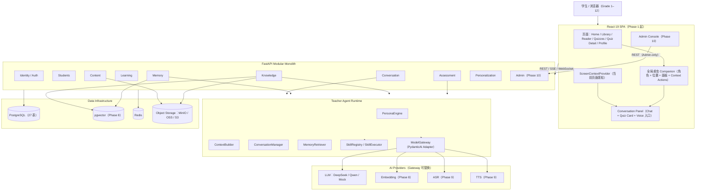
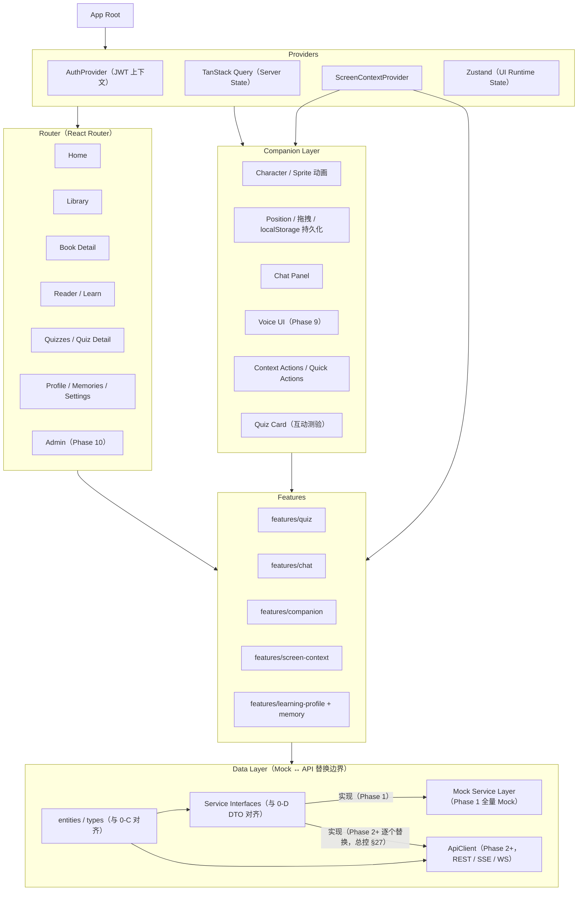
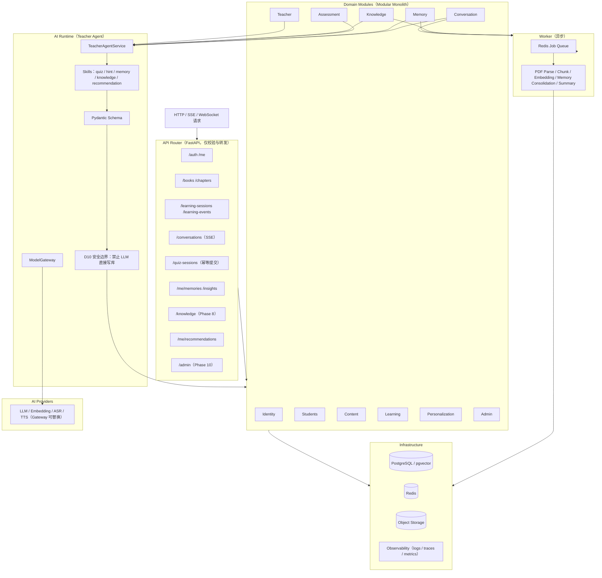
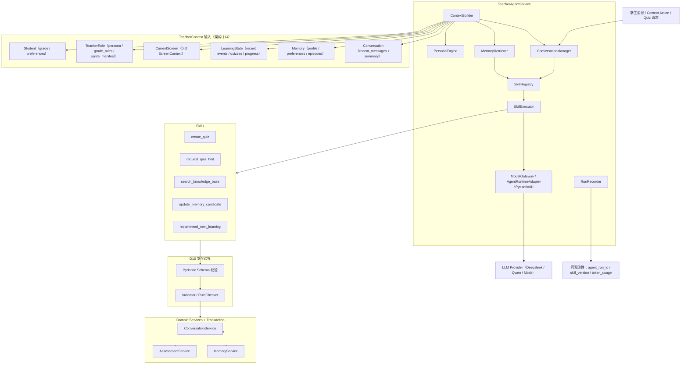
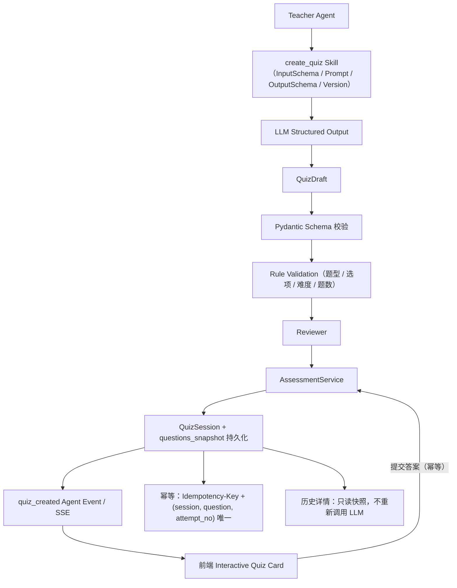
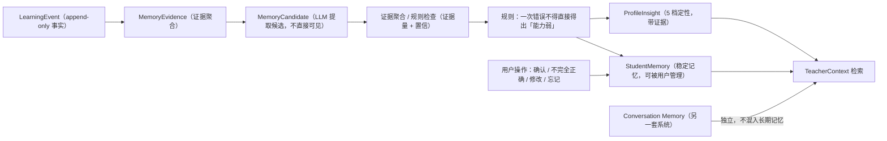
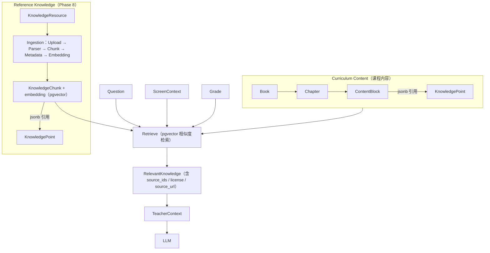
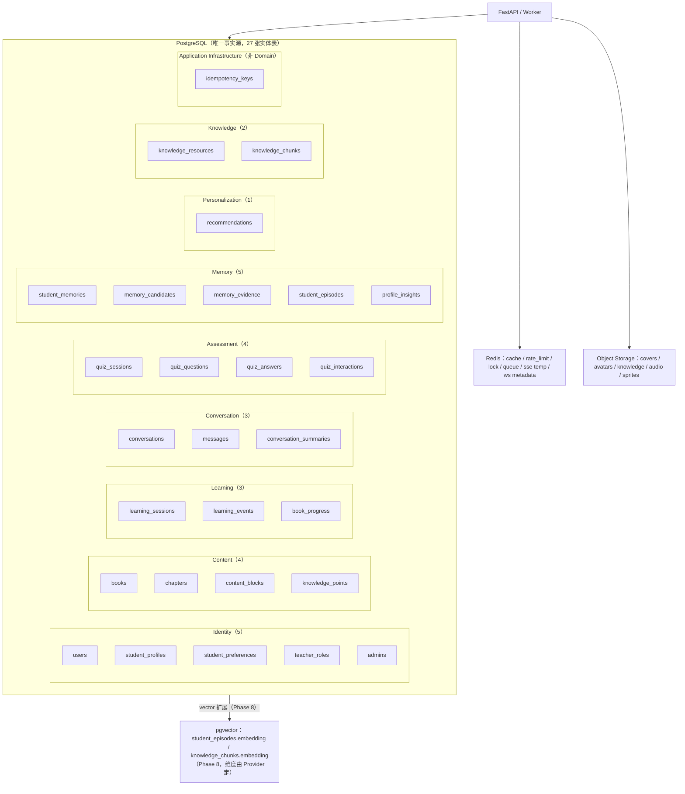

# 霜铃 · K12 AI 数字教师 V3 — Architecture Diagrams（8 张）

> 状态：Phase 0 契约基线（Task 0-F）
> 版本：v0.1
> 日期：2026-08-19
> 输入基线：project-architecture.md（§5/§6/§10/§31/§35，图表权威）、domain-model.md（0-C，27 实体）、database-design.md（0-E，存储分层）、api-contract.md（0-D，模块/SSE/WS）、执行总控 §9.2 Task 0-F 与 §32/§33（参考）
> 阶段声明：**当前是 Phase 0 设计蓝图，不是最终状态**。图中标注「Phase 8/9/10/11」的元素均为后续 Phase 才实现；参考总控 §32 最终架构，但本文件与 0-C/0-D/0-E 的最新边界（27 实体、10 模块、存储分层）保持一致。
> 阅读方式：每张图前 2-3 句说明「表达什么、供谁看」；mermaid 全部为 `flowchart`，可直接渲染。

---

## 1. Overall（系统总览）

表达系统端到端拓扑：学生浏览器 → React SPA（页面 + 桌虫 + 对话面板 + Screen Context）→ FastAPI Modular Monolith（10 个业务模块）→ Teacher Agent Runtime → AI Providers，底层为 PostgreSQL/pgvector + Redis + Object Storage。供架构评审、Phase 1 前端与 Phase 2 后端搭建者看全貌；与 0-D 的模块划分、0-E 的存储分层严格一致。

---

## 2. Frontend（前端架构）

表达 React SPA 的分层：App Root → Providers（Auth / TanStack Query / ScreenContext / Zustand）→ Router 页面 + 全局 Companion Layer → Features → 数据层（Mock Service Layer 与 ApiClient 的替换边界，总控 §27）。供 Phase 1 前端工程师使用；目录结构对应 project-architecture §6.3（app / pages / features / entities / shared / mocks）。

---

## 3. Backend（后端模块化单体）

表达 FastAPI Modular Monolith：Router 只做校验与转发，业务进入 10 个 Domain Modules，Teacher 模块接入 AI Runtime；Worker 承担异步任务；Infrastructure 提供数据库/缓存/存储/可观测性。供 Phase 2 后端工程师与代码评审使用；D10 安全边界（Skill → Pydantic → Validator → Domain Service → Transaction）明确画在 AI 与 Domain 之间。

---

## 4. Teacher Agent Runtime

表达 TeacherAgentService 的七个组成（总控 §13.3）：PersonaEngine、ContextBuilder、ConversationManager、MemoryRetriever、SkillRegistry、SkillExecutor、ModelGateway，加上 RunRecorder；输入侧展示 TeacherContext 的六类数据来源，输出侧展示 Skill → Pydantic → Validator → Domain Service → Transaction 的落库路径（D10）。供 Phase 4 Teacher Agent 实现者与 Skill 开发者使用。

---

## 5. Quiz Skill Flow

表达一次正式测验从 Teacher Agent 到 QuizSession 落库的完整链路（总控 §15.2）：create_quiz → LLM 结构化输出 → QuizDraft → Schema 校验 → Rule 校验 → Reviewer → AssessmentService → 快照持久化 → quiz_created 事件 → 前端互动卡；并标注两条硬约束（提交幂等、历史只读快照）。供 Phase 6 Assessment/Quiz Skill 实现者与验收者使用。

---

## 6. Memory Pipeline

表达长期记忆的分层沉淀（总控 §16.2）：LearningEvent → MemoryEvidence → MemoryCandidate → 证据聚合/规则检查 → StudentMemory / ProfileInsight；强调「一次错误不得直接出结论」与 Conversation Memory 独立。供 Phase 7 Memory Pipeline 与画像实现者、产品验收者使用。

---

## 7. RAG / Knowledge

表达两套内容体系（总控 §17.1）：Curriculum Content（Book → Chapter → ContentBlock ↔ KnowledgePoint）与 Reference Knowledge（KnowledgeResource → 解析/切块/Embedding → KnowledgeChunk/pgvector）；检索输入为 Question + ScreenContext + Grade，输出 RelevantKnowledge（带 source_ids/license/source_url）进入 TeacherContext。供 Phase 8 Knowledge/RAG 实现者使用。

---

## 8. Data（数据架构）

表达存储分层（严格对齐 0-E §1）：PostgreSQL 27 张实体表按域分组（Identity/Content/Learning/Conversation/Assessment/Memory/Personalization/Knowledge）+ 1 张幂等基础设施表；pgvector 两个 embedding 列（Phase 8）；Redis 与 Object Storage 的角色。供 Phase 2 起数据库实现与运维参考。

