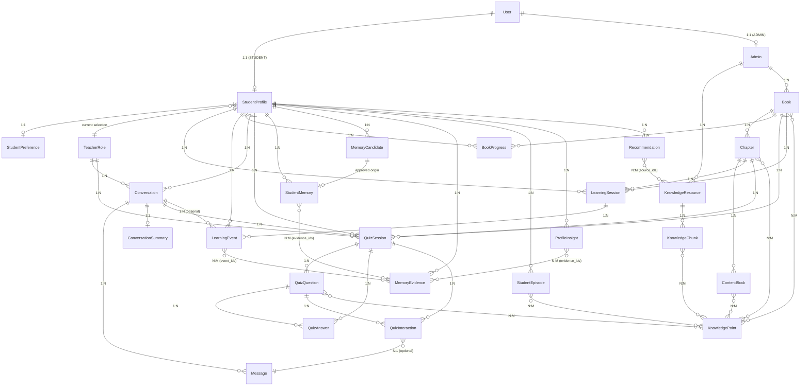

# 霜铃 · K12 AI 数字教师 V3 — Domain Model（正式定义）

> 状态：Phase 0 契约基线（Task 0-C）
> 版本：v0.1
> 日期：2026-08-19
> 输入基线：产品需求总纲 v0.2（§3/§5/§7/§14~§21/§40/§48~§60/§88~§99）、项目架构设计 v0.1（§8/§11/§14/§15/§17~§30/§40/§63）、执行总控（§13.2/§15/§16/§17.5/§28）、Prototype Audit（0-B：Message/BOOKS/QUIZZES/画像数据形状）
> 用途：Task 0-D（API Contract）、0-E（Database Design）、0-G（Traceability）的共同输入。本文只建模，不建表、不写 Migration、不写代码。

---

## 1. 文档目的

定义系统全部核心业务实体的职责、字段、类型、关系与业务不变量，作为后续 API 与数据库设计的权威输入。

本模型遵循三条基线原则：

1. **PostgreSQL 是业务事实源**（架构 §3.2）：所有实体最终可持久化，Redis 只承担缓存/临时状态，不是任何实体的唯一存储。
2. **AI 输出必须经过结构化验证**（架构 §3.5、总控 §28）：LLM 不直接写库，所有 Side Effect 走 `Skill → Pydantic Schema → Validator → Domain Service → Transaction`。
3. **产品先于数据库**（需求 §103）：字段来自产品语义，不因表结构反向裁剪。

---

## 2. 类型与命名约定

| 逻辑类型 | 说明 |
| --- | --- |
| `uuid` | 主键/外键，由 Domain Service 生成；**禁止 LLM 或客户端自造 ID**（总控 §28） |
| `string` | 短文本（名称、枚举键、URL） |
| `text` | 长文本（正文、摘要、解析） |
| `int` | 整数 |
| `float` | 浮点（仅限内部置信度/embedding，永不直接展示给学生） |
| `bool` | 布尔 |
| `date` / `datetime` | 日期 / UTC 时间戳 |
| `enum` | 有限枚举，存储规范大写键；枚举扩展走版本化演进，不改变语义 |
| `jsonb` | 结构化 JSON 载荷，内容必须由 Pydantic Schema 校验 |
| `vector` | 向量（逻辑类型，pgvector 绑定属于 0-E） |

命名约定：

- 主键统一 `*_id`（uuid）；外键引用目标主键名。
- 时间字段统一 `created_at / updated_at`（datetime, UTC）。
- 枚举值统一 SCREAMING_SNAKE_CASE；中文枚举值（如画像档位）为业务领域词汇，按既定集合存储。
- `payload / metadata / snapshot` 类 jsonb 字段必须有版本化 Schema，不允许自由文本直写。

---

## 3. 关键设计决策（本模型必须落实）

| # | 决策 | 落实方式 | 来源 |
| --- | --- | --- | --- |
| D1 | `grade` 只存 `int 1~12` | `StudentProfile.grade`，约束 `1<=grade<=12`；阶段为派生值：1-6 小学、7-9 初中、10-12 高中；「初二 · 8 年级」等展示字符串只存在于前端展示层，**不进入任何存储字段** | 需求 §3.1 |
| D2 | TeacherRole 独立可扩展，学生数据不归属角色 | TeacherRole 实体含 role_id/name/description/persona/tone/teaching_style/avatar/sprite_manifest/voice_id/grade_rules/enabled；StudentProfile 仅持有 `current_teacher_role_id` 引用；切换角色不重置 StudentMemory/ProfileInsight/StudentEpisode | 需求 §5/§21、架构 §15 |
| D3 | Message.type 枚举固定 7 值 | `TEXT / QUIZ / TOOL_STATUS / HINT / RECOMMENDATION / SYSTEM / LEARNING_SUMMARY` | 总控 §13.2 |
| D4 | Conversation 是一等 Domain | 独立实体，含 student_id/teacher_role_id/current_page_context/recent_messages/conversation_summary；**Conversation Memory（刚刚聊了什么）与 Long-term Memory（长期特点）是两套系统**，不可混存 | 需求 §7、架构 §22/§23 |
| D5 | QuizSession 永久保存原题快照 | 保存当时原题、选项、正确答案、学生答案、AI 解析、Hint、Interaction、skill_version；历史详情**不得重新调用 LLM** | 需求 §55/§59、总控 §15.6 |
| D6 | QuizInteraction 枚举固定 6 值 | `HINT_REQUEST / HINT_RESPONSE / QUESTION_ASK / TEACHER_REPLY / ANSWER_SUBMIT / ANSWER_RESULT` | 总控 §15.4 |
| D7 | ProfileInsight 只允许定性档位 | level 仅限 `偏弱 / 一般 / 较稳定 / 较强 / 仍需观察`；**禁止**任何主观百分比/数字（含 0-100 分、掌握度百分比） | 需求 §14/§15/§63、总控 §16.4 |
| D8 | Memory 分层沉淀 | `LearningEvent → MemoryEvidence → MemoryCandidate → 证据聚合/规则检查 → StudentMemory（稳定记忆）/ ProfileInsight`；**一次错误不能直接得出「XX能力弱」** | 需求 §19/§91、总控 §16.2/§16.3 |
| D9 | 推荐与知识来源可溯源 | Recommendation、KnowledgeResource、KnowledgeChunk 均保留 `source_ids / license / source_url` | 总控 §17.5 |
| D10 | LLM 不直接写库 | 所有涉及持久化的 AI 产物（Quiz/Memory/Insight/Recommendation/Summary）必须经 `Skill → Pydantic → Validator → Domain Service → Transaction`；Agent 无任意 SQL 权限 | 总控 §28、架构 §61 |

---

## 4. 实体清单与领域分组

> 说明：任务清单逐项核对后共 **27 个实体**（任务描述中「26 个」为笔误，本模型以清单为准，全部覆盖、无遗漏）。

| 领域组 | 实体 |
| --- | --- |
| 身份与画像 | User、StudentProfile、StudentPreference、TeacherRole |
| 内容 | Book、Chapter、ContentBlock、KnowledgePoint |
| 学习 | LearningSession、LearningEvent、BookProgress |
| 对话 | Conversation、Message、ConversationSummary |
| 测验 | QuizSession、QuizQuestion、QuizAnswer、QuizInteraction |
| 记忆 | StudentMemory、MemoryCandidate、MemoryEvidence、StudentEpisode、ProfileInsight |
| 推荐 | Recommendation |
| 知识 | KnowledgeResource、KnowledgeChunk |
| 管理 | Admin |

---

## 5. 实体定义

### 5.1 身份与画像

#### 5.1.1 User

**职责**：系统登录账号主体，是学生端与管理端的认证边界；业务数据挂到各自的 Profile 上。

**关键字段**

| 字段 | 类型 | 说明 | 约束 |
| --- | --- | --- | --- |
| `user_id` | uuid | 主键 | PK |
| `username` | string | 登录名 | 唯一、非空 |
| `email` | string | 邮箱 | 可空；非空时唯一 |
| `phone` | string | 手机号 | 可空；非空时唯一 |
| `password_hash` | string | 密码哈希 | 非空；只存哈希，禁止明文 |
| `user_type` | enum | `STUDENT / ADMIN` | 非空 |
| `status` | enum | `ACTIVE / DISABLED` | 非空，默认 ACTIVE |
| `created_at` / `updated_at` | datetime | 创建/更新时间 | 自动维护 |
| `last_login_at` | datetime | 最近登录 | 可空 |

**关系**：1:1 `StudentProfile`（user_type=STUDENT 时）；1:1 `Admin`（user_type=ADMIN 时）；1:N `LearningSession`（经 StudentProfile）。

**约束/不变量**：
- 一个 user 只能归属一种业务类型（STUDENT 或 ADMIN），MVP 不允许同时是学生与管理员（如需超管权限，通过 Admin 授权模型扩展）。
- 删除用户走软删（status=DISABLED），保留学习记录（需求 §21 跨年级/长期陪伴，历史数据不可随账号删除而丢失；隐私删除是独立业务流程）。
- 学生年级不放在 User，只放在 StudentProfile（grade 是学习域数据）。

#### 5.1.2 StudentProfile

**职责**：学生的稳定基础资料与学习统计摘要；「学生是谁、几年级、学了多久」的权威来源。

**关键字段**

| 字段 | 类型 | 说明 | 约束 |
| --- | --- | --- | --- |
| `student_id` | uuid | 主键 | PK |
| `user_id` | uuid | 登录账号 | FK→User，唯一 |
| `nickname` | string | 昵称（如「小明」） | 非空，≤32 字符 |
| `avatar_url` | string | 头像地址 | 可空 |
| `grade` | int | 年级 1~12 | **1<=grade<=12**；阶段（小学/初中/高中）由 grade 派生，不存储展示字符串 |
| `birth_date` | date | 出生日期 | 可空；年龄为派生值 |
| `language` | string | 使用语言 | 默认 `zh-CN` |
| `learning_goal` | string | 学习目标 | 可空 |
| `current_teacher_role_id` | uuid | 当前选中的 AI 教师角色 | FK→TeacherRole，可空（默认角色由系统兜底）；**仅当前选择，不含长期数据** |
| `learning_days` / `total_learning_minutes` / `completed_books` / `completed_chapters` / `quiz_count` | int | 统计摘要 | 非负；由 Worker 从 LearningEvent/BookProgress/QuizSession 重算，属于**缓存字段**，不是事实源 |
| `created_at` / `updated_at` | datetime | 时间 | 自动维护 |

**关系**：1:1 `User`；1:1 `StudentPreference`；1:N `LearningSession / LearningEvent / BookProgress / Conversation / QuizSession / StudentMemory / MemoryCandidate / MemoryEvidence / StudentEpisode / ProfileInsight / Recommendation`；N:1 `TeacherRole`（current 选择）。

**约束/不变量**：
- grade 变化不重建档案：跨年级（如 6→7）保留全部学习记录、偏好、情节记忆与画像（需求 §21）。
- 展示字符串（「初二 · 8 年级」）只属于前端渲染，任何 API/数据库字段不得存这类值（D1）。
- 统计摘要字段可能短暂滞后于事件写入，由 Worker 兜底重算；API 不得把这些字段当作业务判定依据（业务判定用 LearningEvent 事实）。

#### 5.1.3 StudentPreference

**职责**：学生的「喜欢怎么学」——解释方式、难度、节奏、语音等偏好（Preference Memory 的稳定输出）。

**关键字段**

| 字段 | 类型 | 说明 | 约束 |
| --- | --- | --- | --- |
| `preference_id` | uuid | 主键 | PK |
| `student_id` | uuid | 学生 | FK→StudentProfile，唯一（每学生一份当前偏好） |
| `preferred_explanation_style` | enum | `EXAMPLE_BASED / VISUAL / STORY / DIRECT_DEFINITION / STEP_BY_STEP / CODE / INTERACTIVE` | 非空；来自 Pydantic 校验后的结构化输出 |
| `preferred_difficulty` | enum | `EASY / MEDIUM / HARD` | 非空 |
| `preferred_session_length` | enum | `SHORT / MEDIUM / LONG` | 非空 |
| `voice_preference` | jsonb | `{ input_enabled, tts_enabled, volume, speed }` | Schema 校验；音量/语速为 UI 设置 |
| `active_questioning_enabled` | bool | 是否开启 AI 主动提问 | 默认 true |
| `daily_learning_minutes` | int | 每次学习时间目标 | 非负 |
| `evidence_ids` | jsonb | 支撑本偏好的 MemoryEvidence id 列表 | 可空；偏好变更必须可溯源 |
| `updated_at` | datetime | 最近更新时间 | 自动维护 |

**关系**：N:1 `StudentProfile`；N:M（引用）`MemoryEvidence`（evidence_ids）。

**约束/不变量**：
- 偏好值只能来自 Memory Pipeline 的结构化输出或用户设置，禁止 LLM 自由文本直写。
- 每学生仅一份当前偏好快照（1:1）；历史版本由 ProfileInsight/StudentMemory 的变更记录承载（需求 §92「画像必须可以变化」），本实体不做偏好版本表。
- 修改偏好必须触发 Toast/确认类 UI 反馈（对应原型 user-menu 与设置页），但该反馈不属于持久化约束。

#### 5.1.4 TeacherRole

**职责**：可扩展 AI 教师角色——呈现形态、人格与教学风格的配置实体；**不持有任何学生数据**。

**关键字段**

| 字段 | 类型 | 说明 | 约束 |
| --- | --- | --- | --- |
| `role_id` | uuid | 主键 | PK |
| `name` | string | 角色名（如「霜铃」） | 非空、唯一 |
| `description` | text | 角色简介 | 可空 |
| `persona` | jsonb | 人格配置：`{ base_persona, character_persona }` | 非空；Schema 校验 |
| `tone` | string | 语气基调 | 非空 |
| `teaching_style` | string | 教学风格描述 | 非空 |
| `avatar` | string | 头像/立绘 URL | 可空 |
| `sprite_manifest` | jsonb | 桌虫动画资产清单：`{ sheet_url, grid_cols, grid_rows, states: [{key,row,frames,label}] }` | 与 0-B spritesheet 契约一致（8×11 网格、状态帧） |
| `voice_id` | string | TTS 语音标识 | 可空；为空则用默认语音 |
| `grade_rules` | jsonb | 年龄适配规则：`{ primary: {...}, junior: {...}, senior: {...} }` | 非空；按学段键组织（需求 §11） |
| `prompt_profile` | jsonb | Prompt 配置/版本 | 可空；带版本号（架构 §63） |
| `interaction_style` | string | 交互风格 | 可空 |
| `enabled` | bool | 是否可选/启用 | 非空，默认 true |
| `version` | int | 配置版本 | 非空；Persona 变更需版本化 |
| `created_at` / `updated_at` | datetime | 时间 | 自动维护 |

**关系**：1:N `Conversation`（按角色发起的会话）；1:N `QuizSession`（生成测验时的角色快照引用）；N:1 `StudentProfile`（被选中）。

**约束/不变量**：
- 学生长期记忆/画像/学习记录全部属于 Student（D2），TeacherRole 上禁止出现学生级字段。
- 切换教师角色只改变呈现与 Persona，不重置、不迁移 StudentMemory（需求 §5）。
- `sprite_manifest` 必须满足 0-B 的 sprite 契约（spritesheet 网格与状态 row/frames），否则前端渲染失败；角色渲染层与 Agent Runtime 解耦（架构 §9.2）。
- 角色变更采用版本化配置；历史 Conversation/QuizSession 需要知道当时用的角色（通过 FK 引用与版本记录）。

---

### 5.2 内容

#### 5.2.1 Book

**职责**：学习书库中的「书」——课程内容与学习进度、测验、推荐挂载的顶层容器。

**关键字段**

| 字段 | 类型 | 说明 | 约束 |
| --- | --- | --- | --- |
| `book_id` | uuid | 主键 | PK |
| `title` | string | 书名 | 非空 |
| `cover_url` | string | 封面地址 | 可空 |
| `description` | text | 简介 | 可空 |
| `grade_min` / `grade_max` | int | 适用年级范围 | 1<=grade_min<=grade_max<=12 |
| `difficulty` | enum | `EASY / MEDIUM / HARD` | 非空 |
| `estimated_minutes` | int | 预计学习时长 | 正数 |
| `author` | string | 作者/来源署名 | 可空 |
| `source_ids` | jsonb | 来源 KnowledgeResource id 列表 | 可空（D9） |
| `license` | string | 版权许可 | 可空但推荐必填（需求 §41） |
| `copyright_status` | string | 版权状态 | 可空 |
| `tags` | jsonb | 主题标签（如 AI 基础/机器人/编程/数据/AI 伦理/数字素养） | 可空；与 0-B `BOOKS.topic` 对齐 |
| `status` | enum | `DRAFT / PUBLISHED / ARCHIVED` | 非空；仅 PUBLISHED 对学生可见 |
| `created_by` | uuid | 创建管理员 | FK→Admin |
| `published_at` | datetime | 发布时间 | 可空 |
| `created_at` / `updated_at` | datetime | 时间 | 自动维护 |

**关系**：1:N `Chapter`；1:N `BookProgress`；1:N `QuizSession`；1:N `LearningSession`；1:N `LearningEvent`；N:M `KnowledgePoint`；N:1 `Admin`（created_by）；N:M（引用）`KnowledgeResource`（source_ids）。

**约束/不变量**：
- 书的「推荐」「是否已开始」「读到第几章」不存储在 Book 上：推荐属于 `Recommendation`，进度属于 `BookProgress`，阅读状态属于派生展示（0-B 的 `book.status/started/recommend` 是前端视图字段）。
- 书库筛选（学段/主题/搜索）是查询行为，不做冗余列；grade 范围与 tags 提供索引输入。

#### 5.2.2 Chapter

**职责**：书的章节——学习单元与学习进度/测验定位的中间层。

**关键字段**

| 字段 | 类型 | 说明 | 约束 |
| --- | --- | --- | --- |
| `chapter_id` | uuid | 主键 | PK |
| `book_id` | uuid | 所属书 | FK→Book |
| `title` | string | 章节标题 | 非空 |
| `chapter_order` | int | 章节顺序 | (book_id, chapter_order) 唯一 |
| `summary` | text | 章节摘要 | 可空 |
| `estimated_minutes` | int | 预计时长 | 正数 |
| `status` | enum | `DRAFT / PUBLISHED / ARCHIVED` | 非空 |
| `created_at` / `updated_at` | datetime | 时间 | 自动维护 |

**关系**：N:1 `Book`；1:N `ContentBlock`；N:M `KnowledgePoint`；1:N `QuizSession`；1:N `LearningSession`；1:N `LearningEvent`；1:N `BookProgress`（当前章引用）。

**约束/不变量**：
- 章顺序唯一且连续由 Content Service 维护，不允许重复 order。
- 章节进度由 BookProgress/ContentBlock 完成情况派生，不在 Chapter 存完成状态。

#### 5.2.3 ContentBlock

**职责**：章节内最小可渲染学习内容单元（段落、知识卡、示例、图解、提示框等），也是 Screen Context 的定位单元。

**关键字段**

| 字段 | 类型 | 说明 | 约束 |
| --- | --- | --- | --- |
| `block_id` | uuid | 主键 | PK |
| `chapter_id` | uuid | 所属章 | FK→Chapter |
| `block_type` | enum | `TITLE / PARAGRAPH / IMAGE / FIGURE / KNOWLEDGE_CARD / EXAMPLE / CALLOUT / HIGHLIGHT` | 非空；对应原型 reader 的 knowledge-card/example-block/callout/figure/mark |
| `content` | jsonb | 内容载荷：`{ text?, image_url?, caption?, svg?, mark_text?, knowledge_card_title? }` | 非空；按 block_type 校验 |
| `block_order` | int | 块顺序 | (chapter_id, block_order) 唯一 |
| `section_key` | string | 章节内锚点（如「训练数据 · 定义」） | 可空；对应 0-B `data-read-section`，用于 Screen Context 定位 |
| `knowledge_point_ids` | jsonb | 关联知识点 id 列表 | 可空 |
| `created_at` / `updated_at` | datetime | 时间 | 自动维护 |

**关系**：N:1 `Chapter`；N:M（引用）`KnowledgePoint`；1:N `LearningEvent`（event.block_id）；1:N `BookProgress`（current_block_id）。

**约束/不变量**：
- block_type 首版只支持 MVP 内容形态（需求 §46）；动画/视频/交互组件属后续扩展，不进入本实体。
- `section_key` 是阅读定位契约（0-B IntersectionObserver 使用 `data-read-section`），React 化与 Content 数据必须保持同一锚点体系。

#### 5.2.4 KnowledgePoint

**职责**：课程内可被关联、检索与出题的最小概念单元（如「训练数据」）；**不含掌握度**。

**关键字段**

| 字段 | 类型 | 说明 | 约束 |
| --- | --- | --- | --- |
| `knowledge_point_id` | uuid | 主键 | PK |
| `name` | string | 名称（如「训练数据」） | 非空 |
| `slug` | string | 唯一标识（如 `training_data`） | 非空、唯一 |
| `description` | text | 定义/说明 | 可空 |
| `topic` | string | 主题域 | 可空 |
| `parent_id` | uuid | 父知识点（层级） | FK→KnowledgePoint，可空（MVP 可选） |
| `status` | enum | `ACTIVE / ARCHIVED` | 非空 |
| `created_at` / `updated_at` | datetime | 时间 | 自动维护 |

**关系**：N:M `Book`；N:M `Chapter`；N:M `ContentBlock`；N:M `KnowledgeChunk`；N:M `QuizQuestion`；N:M `StudentEpisode`；N:1 `KnowledgePoint`（parent）。

**约束/不变量**：
- **明确不做掌握度百分比**（需求 §15、D7）：KnowledgePoint 上禁止任何 score/percent/mastery 数字字段；只允许通过 QuizAnswer/LearningEvent 的事实被引用。
- 知识点层级 MVP 允许为平铺（parent_id 可空），不强制建立全学科知识图谱（架构 §52 明确不做全学科知识图谱）。

---

### 5.3 学习

#### 5.3.1 LearningSession

**职责**：一次进入某书/章的学习时段（从进入到离开），承载学习时长的聚合。

**关键字段**

| 字段 | 类型 | 说明 | 约束 |
| --- | --- | --- | --- |
| `session_id` | uuid | 主键 | PK |
| `student_id` | uuid | 学生 | FK→StudentProfile |
| `book_id` | uuid | 书 | FK→Book |
| `chapter_id` | uuid | 章 | FK→Chapter |
| `started_at` | datetime | 开始时间 | 非空 |
| `ended_at` | datetime | 结束时间 | 可空 |
| `duration_seconds` | int | 时长 | 非负；ended 时 = ended-start |
| `status` | enum | `ACTIVE / ENDED / ABANDONED` | 非空 |
| `entry_route` | string | 进入来源（home/library/reader…） | 可空 |
| `created_at` | datetime | 创建时间 | 自动维护 |

**关系**：N:1 `StudentProfile`；N:1 `Book`；N:1 `Chapter`；1:N `LearningEvent`。

**约束/不变量**：
- 一个学生同一时刻最多一个 ACTIVE LearningSession（进入新 session 时关闭旧 session）——本模型的设计决策，避免并发时长重复统计。
- `ended_at >= started_at`；duration_seconds 由系统计算，不信任客户端传入。

#### 5.3.2 LearningEvent

**职责**：有意义学习行为的**不可变原子记录**，是 Memory Pipeline 的唯一事实输入（D8）。

**关键字段**

| 字段 | 类型 | 说明 | 约束 |
| --- | --- | --- | --- |
| `event_id` | uuid | 主键 | PK |
| `student_id` | uuid | 学生 | FK→StudentProfile |
| `session_id` | uuid | 所属学习时段 | FK→LearningSession，可空 |
| `event_type` | enum | `CHAPTER_STARTED / CHAPTER_FINISHED / SECTION_READ / KNOWLEDGE_CARD_VIEWED / HELP_REQUESTED / EXPLAIN_REQUESTED / SUMMARY_REQUESTED / QUIZ_CREATED / QUIZ_ANSWERED / ANSWER_CORRECT / ANSWER_WRONG / HINT_REQUESTED / QUESTION_ASKED / BOOK_STARTED / BOOK_FINISHED / VOICE_SESSION_STARTED / ROLE_SWITCHED / TEXT_SELECTED` | 非空；可扩展，但不得复用已有语义 |
| `occurred_at` | datetime | 发生时间 | 非空 |
| `book_id` / `chapter_id` / `block_id` | uuid | 学习定位 | 可空（按事件类型要求） |
| `knowledge_point_ids` | jsonb | 相关知识点 | 可空 |
| `conversation_id` / `quiz_session_id` | uuid | 关联对话/测验 | 可空 |
| `payload` | jsonb | 事件载荷：`{ selected_text?, question?, correct?, hint_level?, duration? }` | 非空 Schema；**不含明文密码等敏感信息** |
| `created_at` | datetime | 落库时间 | = occurred_at（不可变） |

**关系**：N:1 `StudentProfile`；N:1 `LearningSession`；N:M `MemoryEvidence`（evidence.event_ids）；N:1 `Conversation`（可空）；N:1 `QuizSession`（可空）；N:M（引用）`KnowledgePoint`。

**约束/不变量**：
- **只追加、不更新、不删除**（审计与记忆依据需要稳定证据）。
- 不是每个动作都产生事件：由前端/Service 按「有意义」阈值生成（如读完一个 section、答错、求助、主动提问），避免事件洪泛（需求 §19）。
- 事件载荷不得含「结论」，只含事实（如「答错第 2 题」是事实；「应用迁移弱」是结论，结论只能进 ProfileInsight）。

#### 5.3.3 BookProgress

**职责**：学生在某本书上的阅读位置与完成状态（每书一行）。

**关键字段**

| 字段 | 类型 | 说明 | 约束 |
| --- | --- | --- | --- |
| `progress_id` | uuid | 主键 | PK |
| `student_id` | uuid | 学生 | FK→StudentProfile |
| `book_id` | uuid | 书 | FK→Book；(student_id, book_id) 唯一 |
| `chapter_id` | uuid | 当前章节 | FK→Chapter，可空；必须属于该书 |
| `block_id` | uuid | 当前内容块 | FK→ContentBlock，可空；必须属于该 chapter |
| `status` | enum | `NOT_STARTED / READING / COMPLETED` | 非空 |
| `position_percent` | int | 阅读位置 0~100 | 0<=x<=100；**位置指示器，不是掌握度** |
| `last_read_at` | datetime | 最近阅读 | 可空 |
| `started_at` / `completed_at` | datetime | 起止 | 可空 |
| `total_seconds` | int | 累计时长 | 非负 |
| `updated_at` | datetime | 更新时间 | 自动维护 |

**关系**：N:1 `StudentProfile`；N:1 `Book`；N:1 `Chapter`（current）；N:1 `ContentBlock`（current）。

**约束/不变量**：
- 每 (student, book) 只有一行；切换到其他章只更新 current 指针，不新建行。
- `status=COMPLETED` 需满足全部章完成（由 Learning Service 校验），不允许客户端直接置位。
- 进度与 0-B「阅读位置 62%」一致：position_percent 是阅读位置（进度条），与知识掌握度百分比无关。

---

### 5.4 对话

#### 5.4.1 Conversation

**职责**：一等 Domain 的连续会话——保存「刚刚聊了什么」的完整上下文（Conversation Memory），与 Long-term Memory 严格分离（D4）。

**关键字段**

| 字段 | 类型 | 说明 | 约束 |
| --- | --- | --- | --- |
| `conversation_id` | uuid | 主键 | PK |
| `student_id` | uuid | 学生 | FK→StudentProfile |
| `teacher_role_id` | uuid | 会话使用的教师角色 | FK→TeacherRole；会话创建时固定 |
| `title` | string | 会话标题 | 可空 |
| `status` | enum | `ACTIVE / ARCHIVED / DELETED` | 非空；DELETED 为软删 |
| `channel` | enum | `TEXT / VOICE` | 非空；语音与文本共享同一会话体系 |
| `current_page_context` | jsonb | Screen Context：`{ route, pageType, bookId?, chapterId?, chapterTitle?, visibleSection?, selectedText?, knowledgePoints?, actions? }` | 与架构 §8/0-B 一致；每次路由切换更新 |
| `recent_messages` | jsonb | 最近 N 条消息的**缓存窗口** | 非空；事实源是 Message 表，此字段仅为构建 TeacherContext 的缓存 |
| `conversation_summary` | text | 长会话压缩摘要（冗余视图） | 可空；正式对象见 ConversationSummary |
| `created_at` / `updated_at` / `last_message_at` | datetime | 时间 | 自动维护 |

**关系**：N:1 `StudentProfile`；N:1 `TeacherRole`；1:N `Message`；1:1 `ConversationSummary`；1:N `QuizSession`；1:N `LearningEvent`（可空引用）。

**约束/不变量**：
- `teacher_role_id` 会话内不变；切换角色 = 新会话（本模型决策，避免同一会话混用 Persona；如产品允许中途切换需 Hermes 裁决）。
- `current_page_context` 来自前端 Screen Context System，必须由后端 Schema 校验后再入库，禁止 LLM 自由构造。
- Conversation Memory（本实体 + Message + Summary）只回答「刚刚聊了什么」；学生长期特点只能从 StudentMemory/ProfileInsight 读取。
- 删除会话（用户隐私，需求 §67）只删除 Message/Summary/Conversation；长期记忆与学习事件是否级联删除由隐私流程单独裁决（风险 5）。

#### 5.4.2 Message

**职责**：会话中的单条消息；类型枚举覆盖对话、测验、工具、提示、推荐、系统与学习总结（D3）。

**关键字段**

| 字段 | 类型 | 说明 | 约束 |
| --- | --- | --- | --- |
| `message_id` | uuid | 主键 | PK |
| `conversation_id` | uuid | 所属会话 | FK→Conversation |
| `role` | enum | `STUDENT / TEACHER / SYSTEM` | 非空 |
| `type` | enum | `TEXT / QUIZ / TOOL_STATUS / HINT / RECOMMENDATION / SYSTEM / LEARNING_SUMMARY` | 非空；**固定 7 值**（总控 §13.2） |
| `content` | text | 消息正文 | TEXT/QUIZ/HINT 等非空；流式完成前由客户端本地态处理，不入库 |
| `metadata` | jsonb | 载荷：`{ quiz_session_id?, hint_level?, tool_state?, recommendation_id?, error_kind?, refusal? }` | Schema 校验；QUIZ 类型必须含 quiz_session_id |
| `sequence` | int | 会话内序号 | (conversation_id, sequence) 唯一 |
| `model_info` | jsonb | `{ provider, model, skill_version? }` | TEACHER 消息可空；用于审计（架构 §62） |
| `created_at` | datetime | 时间 | 自动维护 |

**关系**：N:1 `Conversation`；N:1 `QuizSession`（经 metadata，可空）；N:1 `QuizInteraction`（被 interaction 引用）。

**约束/不变量**：
- 消息**只追加**，不允许编辑/覆盖（除 SYSTEM 纠错可新增修正消息）。
- 学生角色只能产生 TEXT（语音输入转录后同样落为 TEXT）；QUIZ / TOOL_STATUS / HINT / RECOMMENDATION / LEARNING_SUMMARY 只能由系统/教师侧产生。
- 客户端瞬态类型（typing、streaming 光标）**不是持久化类型**，只在 UI 层存在（0-B Message.kind 映射见 §7）。

#### 5.4.3 ConversationSummary

**职责**：长会话的压缩摘要（Worker 异步生成），让长对话不再全量发送历史。

**关键字段**

| 字段 | 类型 | 说明 | 约束 |
| --- | --- | --- | --- |
| `summary_id` | uuid | 主键 | PK |
| `conversation_id` | uuid | 会话 | FK→Conversation，唯一 |
| `summary` | text | 摘要正文 | 非空 |
| `token_count` | int | 摘要 token 数 | 非负 |
| `summary_version` | int | 摘要版本（同一会话可多次更新） | 非空，递增 |
| `source_message_ids` | jsonb | 被压缩的消息 id 范围 | 可空 |
| `model_info` | jsonb | 生成模型信息 | 可空 |
| `created_at` / `updated_at` | datetime | 时间 | 自动维护 |

**关系**：1:1 `Conversation`。

**约束/不变量**：
- 摘要由 Worker 异步生成（架构 §31），不阻塞用户消息流。
- 摘要只服务于 Conversation Memory；**禁止把摘要当作长期记忆**（D4）。
- 生成摘要后，早期消息可被归档（不删除），TeacherContext 组装时按「recent messages + summary + 必要时检索」策略（需求 §7.2、总控 §13.6）。

---

### 5.5 测验

#### 5.5.1 QuizSession

**职责**：正式测验会话——**永久保存原题快照**，历史页只读快照、绝不重新调用 LLM（D5）。

**关键字段**

| 字段 | 类型 | 说明 | 约束 |
| --- | --- | --- | --- |
| `quiz_session_id` | uuid | 主键 | PK |
| `student_id` | uuid | 学生 | FK→StudentProfile |
| `conversation_id` | uuid | 发起对话 | FK→Conversation，非空 |
| `teacher_role_id` | uuid | 生成时角色 | FK→TeacherRole，非空 |
| `book_id` / `chapter_id` | uuid | 关联内容 | FK→Book/Chapter，可空（自由小测） |
| `title` | string | 测验名（如「机器学习基础小测」） | 非空 |
| `quiz_kind` | enum | `CHAPTER_QUIZ / AI_QUIZ` | 非空；对应原型「章节测验/AI 小测」 |
| `status` | enum | `GENERATING / ACTIVE / COMPLETED / ABANDONED` | 非空 |
| `questions_snapshot` | jsonb | **当时原题完整快照**：题面、选项、正确答案、解析、interaction_policy、source_context、knowledge_points | 创建后不可变；历史页唯一数据源 |
| `result_summary` | jsonb | `{ correct, total, hints_used, per_type_summary? }` | COMPLETED 时非空；**只含计数，不含主观百分比结论** |
| `duration_seconds` | int | 用时 | 非负 |
| `ai_feedback` | text | AI 总结点评（如「概念题表现稳定，应用题还需要多练」） | COMPLETED 时可空 |
| `model_info` | jsonb | `{ provider, model, temperature? }` | 非空 |
| `skill_version` | string | Quiz Skill 版本 | **非空**（总控 §15.6/§63） |
| `created_at` / `updated_at` / `completed_at` | datetime | 时间 | 自动维护 |

**关系**：N:1 `StudentProfile`；N:1 `Conversation`；N:1 `TeacherRole`；N:1 `Book`；N:1 `Chapter`；1:N `QuizQuestion`；1:N `QuizAnswer`；1:N `QuizInteraction`。

**约束/不变量**：
- **Snapshot 不可变**：创建后 questions_snapshot 禁止更新；任何重练/错题重做 = 新建 QuizSession（需求 §60），不得覆盖旧记录。
- 历史详情页只能读取快照 + QuizAnswer + QuizInteraction，**禁止任何 LLM 调用**（D5）。
- `skill_version` 保证「历史测验必须知道当时由哪一版规则生成」（架构 §63）。
- 结果只保存客观计数（答对几题/用了几次提示），不生成掌握度百分比（需求 §56 末句）。

#### 5.5.2 QuizQuestion

**职责**：会话内单题（由 Snapshot 派生/实体化），承载题干、选项、正确答案、解析与互动策略。

**关键字段**

| 字段 | 类型 | 说明 | 约束 |
| --- | --- | --- | --- |
| `question_id` | uuid | 主键 | PK |
| `quiz_session_id` | uuid | 所属测验 | FK→QuizSession |
| `question_order` | int | 题序 | (quiz_session_id, question_order) 唯一 |
| `question_type` | enum | `SINGLE_CHOICE / MULTIPLE_CHOICE / TRUE_FALSE / FILL_BLANK` | 非空；MVP 只实现 SINGLE_CHOICE（原型即单选题） |
| `stem` | text | 题干 | 非空 |
| `options` | jsonb | `[{ key, text }]` | 选择题非空 |
| `correct_answer` | jsonb | 正确答案（`{ key }` 或 `{ value }`） | 非空；**服务端权威，live 阶段不下发正确答案给客户端** |
| `explanation` | text | AI 解析（答后展示） | 非空 |
| `source_context` | jsonb | `{ book_id, chapter_id, block_id?, knowledge_points }` | 可空 |
| `interaction_policy` | jsonb | `{ allow_hint: true, max_hint_level: 3 }` | 非空；默认 max_hint_level=3（需求 §53） |
| `knowledge_point_ids` | jsonb | 关联知识点 | 可空 |
| `created_at` | datetime | 时间 | 自动维护 |

**关系**：N:1 `QuizSession`；1:N `QuizAnswer`；1:N `QuizInteraction`；N:M（引用）`KnowledgePoint`。

**约束/不变量**：
- 创建后题目内容不可变（与 Snapshot 一致）；如产品需要修订，只能建新题/新测验。
- 正确答案仅在学生提交后按需可见；Hint 不得直接泄露答案（Hint Skill 规则，需求 §53）。

#### 5.5.3 QuizAnswer

**职责**：学生对单题的提交记录（含每次尝试），是答题历史的原子事实。

**关键字段**

| 字段 | 类型 | 说明 | 约束 |
| --- | --- | --- | --- |
| `answer_id` | uuid | 主键 | PK |
| `quiz_session_id` | uuid | 测验 | FK→QuizSession |
| `question_id` | uuid | 题目 | FK→QuizQuestion |
| `student_id` | uuid | 学生 | FK→StudentProfile |
| `submitted_answer` | jsonb | 学生提交内容 | 非空 |
| `is_correct` | bool | 是否正确 | 非空；由 AssessmentService 判定，不信任客户端 |
| `attempt_no` | int | 第几次尝试 | (quiz_session_id, question_id, attempt_no) 唯一 |
| `hint_level_at_submit` | int | 提交时已用提示级数 | 0<=x<=max_hint_level |
| `is_final` | bool | 是否为最终答案（完成该题） | 非空 |
| `submitted_at` | datetime | 提交时间 | 非空 |
| `created_at` | datetime | 落库时间 | 自动维护 |

**关系**：N:1 `QuizSession`；N:1 `QuizQuestion`；N:1 `StudentProfile`；N:1 `QuizInteraction`（对应 ANSWER_SUBMIT，可空）。

**约束/不变量**：
- **幂等**：同一 (session, question, attempt_no) 重复提交不产生重复 Answer、不重复计入历史、不重复更新证据（总控 §15.7）。
- `is_correct` 由服务端判定并可与提交内容校验；防客户端篡改。
- 每次提交都应有对应的 QuizInteraction（ANSWER_SUBMIT / ANSWER_RESULT），保证「当时互动」完整可回放（需求 §59）。

#### 5.5.4 QuizInteraction

**职责**：测验过程中学生与 AI 互动的**不可变审计日志**（提示、追问、回答、结果）。

**关键字段**

| 字段 | 类型 | 说明 | 约束 |
| --- | --- | --- | --- |
| `interaction_id` | uuid | 主键 | PK |
| `quiz_session_id` | uuid | 测验 | FK→QuizSession |
| `question_id` | uuid | 题目 | FK→QuizQuestion，可空（非题目级互动） |
| `interaction_type` | enum | `HINT_REQUEST / HINT_RESPONSE / QUESTION_ASK / TEACHER_REPLY / ANSWER_SUBMIT / ANSWER_RESULT` | **固定 6 值**（D6） |
| `payload` | jsonb | `{ hint_level?, hint_text?, student_text?, teacher_text?, result?, submitted_answer? }` | 按 type 校验 |
| `message_id` | uuid | 关联的 Message | FK→Message，可空 |
| `answer_id` | uuid | 关联的 Answer | FK→QuizAnswer，可空 |
| `sequence` | int | 会话内互动序号 | (quiz_session_id, sequence) 唯一 |
| `created_at` | datetime | 时间 | 自动维护 |

**关系**：N:1 `QuizSession`；N:1 `QuizQuestion`（可空）；N:1 `Message`（可空）；N:1 `QuizAnswer`（可空）。

**约束/不变量**：
- 只追加不修改（审计完整性）。
- HINT_RESPONSE 必须引用对应的 HINT_REQUEST（经 payload.request_id 或相邻 sequence），保证提示链路可追溯。
- ANSWER_SUBMIT 与 ANSWER_RESULT 成对出现；结果判定与 Answer.is_correct 一致。

---

### 5.6 记忆

#### 5.6.1 StudentMemory

**职责**：稳定长期记忆条目（沉淀后供检索与用户管理），是「AI 记得什么」的权威存储（D8）。

**关键字段**

| 字段 | 类型 | 说明 | 约束 |
| --- | --- | --- | --- |
| `memory_id` | uuid | 主键 | PK |
| `student_id` | uuid | 学生 | FK→StudentProfile |
| `memory_type` | enum | `PROFILE / PREFERENCE / LEARNING / EPISODIC` | 非空；Conversation Memory 不在此列（D4） |
| `content` | text | 记忆内容（如「你喜欢通过例子学习」） | 非空 |
| `tags` | jsonb | 标签（如 例子优先/短时多轮） | 可空 |
| `confidence` | enum | `LOW / MEDIUM / HIGH` | 非空；内部定性置信，**不展示为数字** |
| `status` | enum | `ACTIVE / DISPUTED / SUPERSEDED / REMOVED` | 非空 |
| `evidence_ids` | jsonb | 支撑证据 MemoryEvidence id 列表 | 沉淀时非空 |
| `origin_candidate_id` | uuid | 来源 Candidate | FK→MemoryCandidate，可空 |
| `user_confirmed` | bool | 用户是否确认 | 默认 false |
| `created_at` / `updated_at` / `confirmed_at` | datetime | 时间 | 自动维护 |

**关系**：N:1 `StudentProfile`；N:M（引用）`MemoryEvidence`（evidence_ids）；N:1 `MemoryCandidate`（origin）。

**约束/不变量**：
- 稳定记忆必须满足最小证据量（本模型常量：**至少 2 条独立证据**，或 1 条用户显式确认；具体阈值需 Hermes 定稿）——一次错误不能直接沉淀「XX能力弱」（D8、总控 §16.3）。
- 用户操作（正确/不完全正确/修改/忘记）对应状态流转：确认→user_confirmed=true；不完全正确→DISPUTED（停止参与 prompt）；忘记→REMOVED（软删，仍保留审计）；修改→新增修订版、旧版 SUPERSEDED（需求 §68、总控 §16.5）。
- DISPUTED/REMOVED 记忆不得进入 TeacherContext 检索结果。

#### 5.6.2 MemoryCandidate

**职责**：Memory Pipeline 的中间产物——LLM 提取的「可能值得记」的候选，未通过证据聚合前**不是**记忆。

**关键字段**

| 字段 | 类型 | 说明 | 约束 |
| --- | --- | --- | --- |
| `candidate_id` | uuid | 主键 | PK |
| `student_id` | uuid | 学生 | FK→StudentProfile |
| `candidate_type` | enum | `PROFILE / PREFERENCE / LEARNING / EPISODIC` | 非空 |
| `content` | text | 候选内容 | 非空 |
| `proposed_memory` | jsonb | 结构化建议（字段与 StudentMemory 对齐） | 非空 |
| `evidence_ids` | jsonb | 关联证据 id | 非空 |
| `confidence` | enum | `LOW / MEDIUM / HIGH` | 非空 |
| `status` | enum | `PENDING / APPROVED / REJECTED / MERGED` | 非空 |
| `rule_version` | string | Memory 规则版本 | 非空（架构 §63） |
| `model_info` | jsonb | 生成模型/run 信息 | 非空 |
| `created_at` / `resolved_at` | datetime | 时间 | resolved_at 可空 |

**关系**：N:1 `StudentProfile`；N:M（引用）`MemoryEvidence`；N:1 `StudentMemory`（APPROVED 后）。

**约束/不变量**：
- 候选不直接对外展示、不参与检索；只有 APPROVED 并沉淀为 StudentMemory 后才可见。
- 候选必须引用 ≥1 条 MemoryEvidence（证据来自 LearningEvent），无证据的候选直接 REJECTED。
- 所有候选由 Worker/后台 Pipeline 处理（架构 §31），不占用聊天请求路径。

#### 5.6.3 MemoryEvidence

**职责**：支撑记忆/画像判断的证据聚合（由 LearningEvent 归并），是「为什么这样判断」的引证来源（需求 §93）。

**关键字段**

| 字段 | 类型 | 说明 | 约束 |
| --- | --- | --- | --- |
| `evidence_id` | uuid | 主键 | PK |
| `student_id` | uuid | 学生 | FK→StudentProfile |
| `source_type` | enum | `QUIZ / LEARNING_SESSION / CONVERSATION / BOOK_PROGRESS` | 非空 |
| `event_ids` | jsonb | 归并的 LearningEvent id 列表 | 非空，≥1 |
| `payload` | jsonb | 聚合事实：`{ correct_count?, wrong_count?, hint_levels?, time_range?, sample_texts? }` | 非空；**只含事实，不含结论** |
| `count` | int | 事件数 | 非负 |
| `first_occurred_at` / `last_occurred_at` | datetime | 时间范围 | 可空 |
| `derived_at` | datetime | 聚合时间 | 非空 |
| `rule_version` | string | 聚合规则版本 | 非空 |

**关系**：N:1 `StudentProfile`；N:M（引用）`LearningEvent`（event_ids）；N:1 `MemoryCandidate`（可空）；N:1 `StudentMemory`（可空）；N:M（引用）`ProfileInsight`（evidence_ids）。

**约束/不变量**：
- 不可变：证据一旦聚合不再修改；新证据产生新聚合（版本化），旧证据保留。
- 证据与结论分离：payload 只记录「三次应用迁移练习中两次需要二级提示」这类事实，不允许写「应用迁移弱」（结论只能出现在 ProfileInsight/StudentMemory）。

#### 5.6.4 StudentEpisode

**职责**：情节记忆——有意义学习事件的高层叙事片段，可 embedding 检索（Episodic Memory）。

**关键字段**

| 字段 | 类型 | 说明 | 约束 |
| --- | --- | --- | --- |
| `episode_id` | uuid | 主键 | PK |
| `student_id` | uuid | 学生 | FK→StudentProfile |
| `title` | string | 情节标题 | 非空 |
| `summary` | text | 情节叙事（如「对训练数据产生疑惑，通过小狗比喻后理解」） | 非空 |
| `occurred_at` | datetime | 发生时间 | 非空 |
| `event_ids` | jsonb | 支撑的 LearningEvent id | 非空，≥1 |
| `book_id` / `chapter_id` | uuid | 定位 | 可空 |
| `knowledge_point_ids` | jsonb | 知识点 | 可空 |
| `embedding` | vector | 向量（pgvector） | 可空；由 Worker 生成 |
| `importance` | enum | `LOW / MEDIUM / HIGH` | 非空 |
| `tags` | jsonb | 标签 | 可空 |
| `created_at` | datetime | 时间 | 自动维护 |

**关系**：N:1 `StudentProfile`；N:M（引用）`LearningEvent`；N:M（引用）`KnowledgePoint`。

**约束/不变量**：
- 只沉淀「有意义」事件（Pipeline 过滤），不逐句记录（需求 §18/§19）。
- embedding 使用 pgvector 边界（架构 §28），普通关系字段仍存 PostgreSQL。
- 用户可删除情节（隐私，需求 §67/§68）；删除走软删并保留事件事实。

#### 5.6.5 ProfileInsight

**职责**：AI 学习画像的定性判断条目（优势/薄弱/习惯/变化/理解），**只允许五档定性描述**（D7）。

**关键字段**

| 字段 | 类型 | 说明 | 约束 |
| --- | --- | --- | --- |
| `insight_id` | uuid | 主键 | PK |
| `student_id` | uuid | 学生 | FK→StudentProfile |
| `insight_type` | enum | `STRENGTH / WEAKNESS / UNDERSTANDING / HABIT / CHANGE / INTEREST` | 非空；对应「我的优势/当前薄弱方向/编程思维·AI基础理解/学习习惯/最近变化」 |
| `dimension` | string | 维度（如 `concept`、`application_transfer`、`programming_thinking`、`ai_basics`、`questioning_habit`） | 非空；slug 形式 |
| `level` | enum | **`偏弱 / 一般 / 较稳定 / 较强 / 仍需观察`** | **仅此 5 档，禁止数字/百分比** |
| `description` | text | 定性描述（如「把概念放进新情境时偶尔需要二级提示」） | 非空 |
| `evidence_ids` | jsonb | 支撑证据 | 非空，≥1 |
| `status` | enum | `ACTIVE / SUPERSEDED` | 非空 |
| `valid_from` / `valid_until` | datetime | 有效区间 | valid_from 非空；SUPERSEDED 时 valid_until 非空 |
| `rule_version` | string | 画像规则版本 | 非空 |
| `model_info` | jsonb | 生成模型信息 | 可空 |
| `created_at` / `updated_at` | datetime | 时间 | 自动维护 |

**关系**：N:1 `StudentProfile`；N:M（引用）`MemoryEvidence`（evidence_ids）。

**约束/不变量**：
- **任何字段禁止存储百分比、分数、0-100 数值**（D7、需求 §14/§15/§63、总控 §16.4）；`level` 枚举即数值替代品。
- 每条 insight 必须 ≥1 条证据，AI 解释画像时只能引用真实 MemoryEvidence（总控 §16.7）。
- 画像必须可变：新证据产生新版本，旧版 SUPERSEDED 而非删除，保留变化轨迹（需求 §92、0-B changelog）。
- 一次错误不得生成「XX能力弱」；需满足 StudentMemory 同款最小证据量规则（D8）。

---

### 5.7 推荐

#### 5.7.1 Recommendation

**职责**：可解释的下一步学习建议（书/章/复习/测验/今日计划），必须能回答「为什么推荐」。

**关键字段**

| 字段 | 类型 | 说明 | 约束 |
| --- | --- | --- | --- |
| `recommendation_id` | uuid | 主键 | PK |
| `student_id` | uuid | 学生 | FK→StudentProfile |
| `recommendation_type` | enum | `BOOK / CHAPTER / REVIEW / QUIZ / DAILY_PLAN` | 非空 |
| `book_id` / `chapter_id` | uuid | 推荐目标 | FK→Book/Chapter，按类型可空 |
| `title` | string | 推荐标题 | 非空 |
| `reason` | text | 推荐理由（「为什么推荐？」） | **非空**（需求 §43/§72） |
| `evidence_ids` | jsonb | 依据证据（测验表现/学习事件） | 可空 |
| `source_ids` | jsonb | 引用知识来源 KnowledgeResource id | 可空（D9） |
| `license` | string | 引用内容的许可 | 可空 |
| `source_url` | string | 引用来源 URL | 可空 |
| `status` | enum | `ACTIVE / DISMISSED / EXPIRED` | 非空 |
| `expires_at` | datetime | 过期时间 | 可空 |
| `model_info` | jsonb | 生成模型信息 | 可空 |
| `skill_version` | string | 推荐 Skill 版本 | 非空 |
| `created_at` | datetime | 时间 | 自动维护 |

**关系**：N:1 `StudentProfile`；N:1 `Book`（可空）；N:1 `Chapter`（可空）；N:M（引用）`MemoryEvidence`；N:M（引用）`KnowledgeResource`（source_ids）。

**约束/不变量**：
- 无理由不推荐：`reason` 必须可追溯到证据或学习事件（需求 §72）。
- 首页「霜铃推荐」「为什么推荐？」（0-B）由本实体供给；推荐被点击/忽略后状态流转（ACTIVE→DISMISSED/EXPIRED）。
- 引用外部知识必须保留 source_ids/license/source_url（D9、总控 §17.5）。

---

### 5.8 知识

#### 5.8.1 KnowledgeResource

**职责**：外部知识资料（Reference Knowledge）的元数据与处理状态；与课程内容（Book/Chapter）是两套内容体系（总控 §17.1）。

**关键字段**

| 字段 | 类型 | 说明 | 约束 |
| --- | --- | --- | --- |
| `resource_id` | uuid | 主键 | PK |
| `source_name` | string | 来源名称 | 非空 |
| `source_url` | string | 来源 URL | 非空（D9） |
| `author` | string | 作者 | 可空 |
| `license` | string | 许可协议 | **非空**（需求 §41/§84、D9） |
| `copyright_status` | string | 版权状态 | 非空 |
| `storage_key` | string | Object Storage 对象键 | 非空 |
| `file_type` | enum | `PDF / MARKDOWN / TXT / HTML` | 非空 |
| `status` | enum | `UPLOADED / PARSING / CHUNKING / INDEXING / READY / FAILED` | 非空；READY 才可被检索 |
| `uploaded_by` | uuid | 上传管理员 | FK→Admin |
| `error` | text | 失败原因 | FAILED 时非空 |
| `uploaded_at` / `created_at` / `updated_at` | datetime | 时间 | 自动维护 |

**关系**：1:N `KnowledgeChunk`；N:1 `Admin`；N:M（引用）`Recommendation`（source_ids）；N:M（引用）`Book`（source_ids）。

**约束/不变量**：
- 上传后内容走 Worker Pipeline：解析→切块→metadata→embedding→READY（架构 §29/§31），HTTP 请求不做重任务。
- license/copyright 是法律合规底线，缺省禁止发布（需求 §41）。

#### 5.8.2 KnowledgeChunk

**职责**：知识切块 + 向量索引单元（RAG 检索的最小单位）。

**关键字段**

| 字段 | 类型 | 说明 | 约束 |
| --- | --- | --- | --- |
| `chunk_id` | uuid | 主键 | PK |
| `resource_id` | uuid | 所属资料 | FK→KnowledgeResource |
| `chunk_index` | int | 块序号 | (resource_id, chunk_index) 唯一 |
| `content` | text | 切块文本 | 非空 |
| `content_type` | string | 内容类型/标题 | 可空 |
| `metadata` | jsonb | `{ source_url, license, page?, heading? }` | 可空；检索结果必须能溯源 |
| `knowledge_point_ids` | jsonb | 绑定知识点 | 可空 |
| `embedding` | vector | 向量 | READY 时非空 |
| `token_count` | int | token 数 | 非负 |
| `status` | enum | `PENDING / READY / FAILED` | 非空 |
| `created_at` | datetime | 时间 | 自动维护 |

**关系**：N:1 `KnowledgeResource`；N:M（引用）`KnowledgePoint`。

**约束/不变量**：
- embedding 由 EmbeddingProvider 生成并写入 pgvector；维度必须与 provider 一致（架构 §35/§36）。
- 检索结果回传必须携带 metadata（source_url/license），供 TeacherContext 引用（D9）。

---

### 5.9 管理

#### 5.9.1 Admin

**职责**：轻量管理员端身份——只负责平台内容维护，不参与教学业务（需求 §4）。

**关键字段**

| 字段 | 类型 | 说明 | 约束 |
| --- | --- | --- | --- |
| `admin_id` | uuid | 主键 | PK |
| `user_id` | uuid | 登录账号 | FK→User，唯一 |
| `display_name` | string | 显示名 | 非空 |
| `role_level` | enum | `SUPERVISOR / CONTENT_EDITOR` | 非空；MVP 可只保留 SUPERVISOR |
| `permissions` | jsonb | 权限列表 | 可空；Schema 校验 |
| `enabled` | bool | 是否启用 | 非空 |
| `created_at` / `updated_at` | datetime | 时间 | 自动维护 |

**关系**：1:1 `User`；1:N `Book`（created_by）；1:N `KnowledgeResource`（uploaded_by）。

**约束/不变量**：
- 管理员权限边界只覆盖内容域（书/章/知识库/来源/处理状态），**禁止**学生成绩、画像、记忆、测验数据的管理入口（需求 §4）。
- 内容操作走 Admin Domain Service + 审计（created_by/updated_by 可追溯）。

---

## 6. 关系总览

### 6.1 Mermaid ER Diagram（主要关联）

### 6.2 关系明细表

| 源实体 | 关系 | 目标实体 | 基数 | 说明 |
| --- | --- | --- | --- | --- |
| User | 拥有 | StudentProfile | 1:1 | user_type=STUDENT |
| User | 拥有 | Admin | 1:1 | user_type=ADMIN |
| StudentProfile | 拥有 | StudentPreference | 1:1 | 当前偏好快照 |
| StudentProfile | 选择 | TeacherRole | N:1 | current_teacher_role_id，可空 |
| StudentProfile | 拥有 | LearningSession / LearningEvent / BookProgress / Conversation / QuizSession / StudentMemory / MemoryCandidate / MemoryEvidence / StudentEpisode / ProfileInsight / Recommendation | 1:N | 全部按 student_id 归属 |
| TeacherRole | 发起 | Conversation | 1:N | 会话创建时固定角色 |
| TeacherRole | 生成 | QuizSession | 1:N | 测验记录角色 |
| Book | 包含 | Chapter | 1:N | chapter_order 排序 |
| Book | 关联 | KnowledgePoint | N:M | 书级知识点 |
| Book | 拥有 | BookProgress / QuizSession / LearningSession | 1:N | 内容定位 |
| Book | 引用 | KnowledgeResource | N:M | source_ids |
| Book | 创建 | Admin | N:1 | created_by |
| Chapter | 包含 | ContentBlock | 1:N | block_order 排序 |
| Chapter | 关联 | KnowledgePoint | N:M | 章节级知识点 |
| Chapter | 定位 | QuizSession / LearningSession / BookProgress / LearningEvent | 1:N | chapter_id |
| ContentBlock | 关联 | KnowledgePoint | N:M | knowledge_point_ids |
| ContentBlock | 定位 | LearningEvent / BookProgress | 1:N | block_id |
| KnowledgePoint | 关联 | KnowledgeChunk / QuizQuestion / StudentEpisode | N:M | 可检索/可出题 |
| LearningSession | 记录 | LearningEvent | 1:N | session 内事件 |
| LearningEvent | 归并 | MemoryEvidence | N:M | evidence.event_ids |
| Conversation | 包含 | Message | 1:N | sequence 排序 |
| Conversation | 压缩 | ConversationSummary | 1:1 | 长会话摘要 |
| Conversation | 发起 | QuizSession | 1:N | 测验挂在会话下 |
| Message | 关联 | QuizSession / QuizInteraction | N:1 | 经 metadata/message_id，可空 |
| QuizSession | 包含 | QuizQuestion | 1:N | question_order |
| QuizSession | 记录 | QuizAnswer / QuizInteraction | 1:N | 答案与互动 |
| QuizQuestion | 记录 | QuizAnswer / QuizInteraction | 1:N | 单题维度 |
| QuizAnswer | 关联 | QuizInteraction | N:1 | 对应 ANSWER_SUBMIT，可空 |
| MemoryCandidate | 沉淀 | StudentMemory | N:1 | APPROVED 后 |
| MemoryEvidence | 支撑 | StudentMemory / ProfileInsight / MemoryCandidate | N:M | evidence_ids |
| StudentMemory | 归纳 | ProfileInsight | N:M | insight 可基于多条稳定记忆 |
| StudentEpisode | 聚合 | LearningEvent | N:M | event_ids |
| Recommendation | 引用 | KnowledgeResource | N:M | source_ids |
| KnowledgeResource | 切块 | KnowledgeChunk | 1:N | chunk_index |
| KnowledgeChunk | 绑定 | KnowledgePoint | N:M | knowledge_point_ids |
| Admin | 管理 | Book / KnowledgeResource | 1:N | created_by/uploaded_by |

---

## 7. 与 UI 原型契约（0-B）的一致性

### 7.1 Message 映射

| 原型 `message.kind`（0-B） | 持久化 `Message.type` | 说明 |
| --- | --- | --- |
| `text`（ai/user 普通消息） | `TEXT` | role 区分 STUDENT/TEACHER |
| `quiz` | `QUIZ` | metadata.quiz_session_id 必填 |
| `tool` | `TOOL_STATUS` | metadata.tool_state（running/done） |
| `hint`（原型用 text + meta「提示 n/3」） | `HINT` | metadata.hint_level；0-B 的渲染形状保留 |
| `recommendation` 类回复（原型为 text） | `RECOMMENDATION` | metadata.recommendation_id 可空；页面仍按 TEXT 气泡渲染 |
| `error` / `refuse` | `SYSTEM` | metadata.error_kind / refusal |
| `typing` / `streaming` | 不持久化 | 客户端瞬态，只存在于 UI 层 |
| 页面总结类回复 | `LEARNING_SUMMARY` | metadata.summary_kind |

约束：原型 `meta` 字符串（如「霜铃 · 当前页面上下文」「第 1 题 / 共 3 题」）对应 `Message.metadata` 的结构化字段；前端展示文本由渲染层生成，不要求后端存同样字符串。

### 7.2 Quiz 映射

| 原型 `QUIZZES` 字段 | Domain 实体字段 |
| --- | --- |
| `id`（q1/q2/q3/q-live） | `QuizSession.quiz_session_id`（域内为 uuid；Mock 字符串仅用于 0-B 原型） |
| `date` | `QuizSession.created_at`（展示层格式化） |
| `type`（章节测验/AI 小测） | `QuizSession.quiz_kind`（CHAPTER_QUIZ/AI_QUIZ） |
| `name` | `QuizSession.title` |
| `book` / `chapter` | `QuizSession.book_id / chapter_id` |
| `score`（`8 / 10`） | `QuizSession.result_summary { correct, total }`（展示字符串由前端拼装） |
| `meta`（使用 N 次提示） | `QuizSession.result_summary.hints_used` + `QuizInteraction` |
| `note`（AI 点评） | `QuizSession.ai_feedback` |
| `term` | 原型占位字段，Domain 不保留；由 skill_version/rule_version 取代 |
| 聊天内 quiz 卡（选项/提交/提示/修正） | `QuizQuestion` + `QuizAnswer` + `QuizInteraction`（HINT_REQUEST/HINT_RESPONSE/ANSWER_SUBMIT/ANSWER_RESULT） |

### 7.3 BOOKS 与学生画像映射

- `BOOKS.topic / grade / chapters / minutes / keywords` → `Book.tags / grade_min/grade_max / Chapter 计数（派生）/ estimated_minutes / description`；`tint` 是前端视觉变体，不入库。
- `BOOKS.started / status / recommend` → `BookProgress.status` 与 `Recommendation`（推荐理由可解释）。
- 原型学生画像（frontmatter：preferred_explanation_style/difficulty/session_length）→ `StudentPreference`；「AI 对我的认识/优势/薄弱/习惯/最近变化」→ `ProfileInsight`（含 level 档位与 evidence）；记忆列表 → `StudentMemory`；changelog → `ProfileInsight` 版本轨迹（SUPERSEDED 保留）。
- `xiaoming.agent.md` 只是 Structured Memory 的 Markdown 渲染视图，**不是数据库事实源**（总控 §16.6）。

---

## 8. 明确不做（后续 Phase / 不属于本 Domain Model）

以下内容**只建模或不建模**，本任务不实现：

1. **知识掌握度百分比体系**：KnowledgePoint/ProfileInsight 均无 mastery score/percent 字段；等可靠评估模型出现后单独设计（需求 §15）。
2. **多 Agent / 复杂 Workflow**：MVP 是单 Teacher Agent + Skills（架构 §53），不建模 Agent 集群、LangGraph、Workflow Engine。
3. **教师端 / 班级 / 作业 / 家长端**：User 仅 STUDENT/ADMIN 两种类型（需求 §4/§97）。
4. **ScreenContext / TeacherContext**：是运行时输入结构（架构 §8/§14），不属于持久化实体；其字段形状由 0-D API Contract 定义，Conversation.current_page_context 只存其快照。
5. **BackgroundJob**：架构 §40 的 Job 是基础设施状态（队列/重试/日志），不属于业务 Domain 实体；0-E 数据库设计时单独建模。
6. **语音音频/实时会话状态**：语音复用 Conversation + Message（TEXT/VOICE channel），不单独建 VoiceSession 实体；WebSocket 连接元数据归 Redis（架构 §33）。
7. **Live2D / Spine / 3D 角色运行时**：TeacherRole.sprite_manifest 只保存资产契约，渲染 Runtime 解耦（架构 §9.2）。
8. **事件溯源 / CQRS / 微服务 / 独立向量库**：架构 §52 明确不做，本模型按 Modular Monolith + PostgreSQL/pgvector 设计。
9. **推荐算法本身**：Recommendation 实体只定义数据契约；推荐逻辑（Skill/规则/模型）属于后续 Phase 2+。
10. **知识掌握「难度/易错点」等派生画像**：由 ProfileInsight 的 dimension 扩展承载，不新增实体。

---

## 9. 待 Hermes 裁决的歧义

1. 任务描述写「26 个实体」，清单实际为 27 个（本模型全部覆盖）——确认验收口径。
2. `ProfileInsight.level` 采用总控 §16.4 的 5 档（偏弱/一般/较稳定/较强/仍需观察）；需求 §63 示例还出现「较弱/稳定」，与总控不一致，本模型以总控为准。
3. 稳定记忆最小证据量（本模型暂定 ≥2 条独立证据或 1 次用户确认）需要定稿。
4. Conversation 的 teacher_role_id 是否允许会话中途切换（本模型：不允许，切换=新会话）。
5. 用户删除会话/记忆时，是否级联删除 LearningEvent/QuizSession（隐私 vs 证据完整性冲突）。
6. StudentPreference 采用 1:1 当前快照，是否需要版本化历史（本模型：暂不需要，变更轨迹走 ProfileInsight/StudentMemory）。
7. `quiz_kind`（章节测验/AI 小测）与 QuizSession.status 的枚举是否需要再细分（如「再次练习」来源标记）。
