# 霜铃 · K12 AI 数字教师 V3 —— 详细开发实施路线图

> 版本：v1.0  
> 日期：2026-08-19  
> 项目类型：Greenfield 重构项目  
> 核心定位：面向小学一年级至高中三年级学生、可长期陪伴成长的 AI 数字教师  
> UI/Interaction Reference Baseline：`shuangling-v3-prototype.html`  
> Product Requirements Baseline：`K12_AI数字教师_V3_产品需求总纲_v0.2.md`

---

# 1. 文档目标

本文件用于指导「霜铃 V3」从 Open Design 单文件原型逐步落地为真实可运行产品。

本项目**不直接继承旧项目的数据库、API、前端组件树和后端结构**。旧项目只作为技术经验参考。

后续所有实现以两个基线为准：

1. **产品需求总纲**：决定产品做什么；
2. **当前 Open Design 原型**：决定产品如何展示与交互。

当前 HTML 原型不是生产代码，而是 **UI / Interaction Reference Baseline**。

---

# 2. 总体原则

## 2.1 开发顺序

```text
产品体验
↓
Domain Model
↓
API Contract
↓
Database Design
↓
Backend Services
↓
Teacher Agent / Skills
↓
前端接真实 API
↓
E2E / Production Hardening
```

## 2.2 Frontend Contract First

先把 HTML 原型正式 React 化，并保留 Mock Service，让完整体验可运行；再逐领域替换成真实 API。

```text
Prototype HTML
↓
React Production UI + Mock Service
↓
React + Real API
↓
FastAPI + PostgreSQL
↓
Teacher Agent + Quiz Skill + Memory + RAG + Voice
```

## 2.3 一个 Teacher Agent + Skills

首版只使用一个核心 Teacher Agent：

```text
TeacherAgent
├── PersonaEngine
├── ContextBuilder
├── ConversationManager
├── MemoryRetriever
├── SkillRegistry
└── ModelGateway
```

通过 Skill 扩展能力，而不是拆成大量 Agent。

## 2.4 LLM 不是真相源

LLM 不允许直接修改数据库业务状态。它只允许：

- 理解；
- 推理；
- 生成 Candidate；
- 调用 Skill。

真正写入必须经过：

```text
Schema
→ Validation
→ Domain Service
→ Transaction
→ Database
```

---

# 3. 技术栈

## Frontend

- React 19
- TypeScript
- Vite
- React Router
- Tailwind CSS
- Radix Primitives
- Motion
- TanStack Query
- Zustand

职责：

| 技术 | 职责 |
|---|---|
| React | UI / Component Model |
| TypeScript | Domain 类型与契约 |
| Vite | SPA 构建 |
| React Router | 页面路由 |
| Tailwind | Design Token / 样式基础 |
| Radix | Dialog / Popover / Sheet 等无头组件 |
| Motion | 桌虫、面板与页面动效 |
| TanStack Query | Server State |
| Zustand | Companion / UI / Stream State |

## Backend

- Python
- FastAPI
- Pydantic
- SQLAlchemy 2
- Alembic

## Data

- PostgreSQL
- pgvector
- Redis
- S3 Compatible Object Storage（开发可用 MinIO）

## AI

- 自研轻量 Teacher Agent Runtime
- Model Gateway
- Quiz Skill
- Hint Skill
- Memory Pipeline
- RAG / Knowledge Retrieval

## Realtime

- AI 文本：SSE
- ASR：WebSocket
- TTS：HTTP Streaming / Provider Streaming

## Test

- Frontend：Vitest + Playwright
- Backend：Pytest + pytest-asyncio + httpx

## Deployment

- Docker Compose

首版不引入：Kubernetes、Kafka、MongoDB、独立向量数据库、重型 LangChain、多 Agent 集群。

---

# 4. 整体系统架构

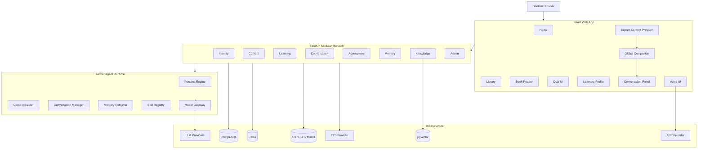

---

# 5. 前端架构

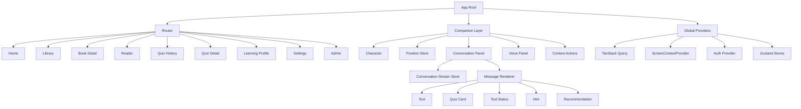

推荐目录：

```text
frontend/src/
├── app/
│   ├── router/
│   └── providers/
├── pages/
│   ├── home/
│   ├── library/
│   ├── reader/
│   ├── quizzes/
│   ├── profile/
│   └── settings/
├── features/
│   ├── companion/
│   ├── conversation/
│   ├── quiz/
│   ├── memory/
│   └── screen-context/
├── entities/
│   ├── student/
│   ├── book/
│   ├── conversation/
│   ├── quiz/
│   └── memory/
├── shared/
│   ├── api/
│   ├── ui/
│   ├── hooks/
│   ├── lib/
│   └── styles/
└── mocks/
```

---

# 6. 后端模块化单体架构

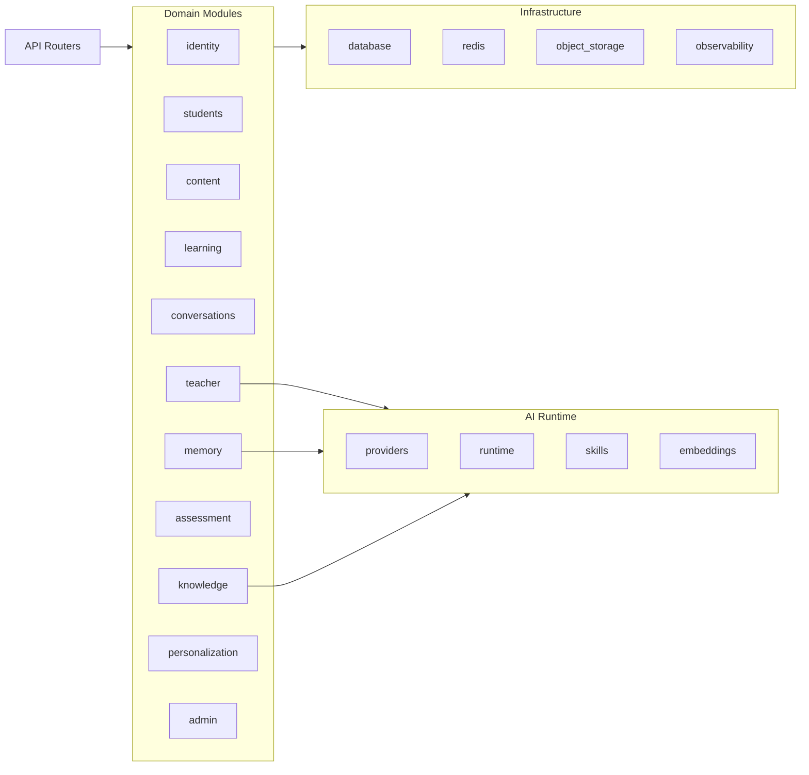

推荐目录：

```text
backend/app/
├── modules/
│   ├── identity/
│   ├── students/
│   ├── content/
│   ├── learning/
│   ├── conversations/
│   ├── teacher/
│   ├── memory/
│   ├── assessment/
│   ├── knowledge/
│   ├── personalization/
│   └── admin/
├── ai/
│   ├── providers/
│   ├── runtime/
│   ├── skills/
│   └── embeddings/
├── infrastructure/
│   ├── database/
│   ├── cache/
│   ├── storage/
│   └── observability/
└── main.py
```

---

# 7. 数据与存储架构

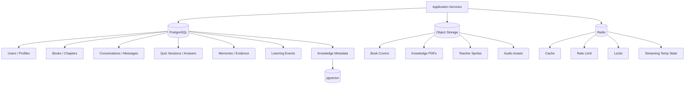

核心 Domain：

```text
User
StudentProfile
StudentPreference
TeacherRole
Book
Chapter
ContentBlock
KnowledgePoint
LearningSession
LearningEvent
BookProgress
Conversation
Message
ConversationSummary
QuizSession
QuizQuestion
QuizAnswer
QuizInteraction
StudentMemory
MemoryEvidence
StudentEpisode
ProfileInsight
Recommendation
KnowledgeResource
KnowledgeChunk
Admin
```

---

# 8. Conversation 设计

Conversation 必须是一等 Domain，不允许只做一个无状态 `/chat`。

```text
Conversation
├── Message
├── Message
├── ToolCall
├── Quiz Message
├── Hint Message
└── ConversationSummary
```

MessageType：

```text
TEXT
QUIZ
TOOL_STATUS
HINT
RECOMMENDATION
SYSTEM
LEARNING_SUMMARY
```

长会话策略：

```text
最近若干轮完整 Message
+
Conversation Summary
+
必要时检索相关旧消息
```

---

# 9. Teacher Agent 请求流

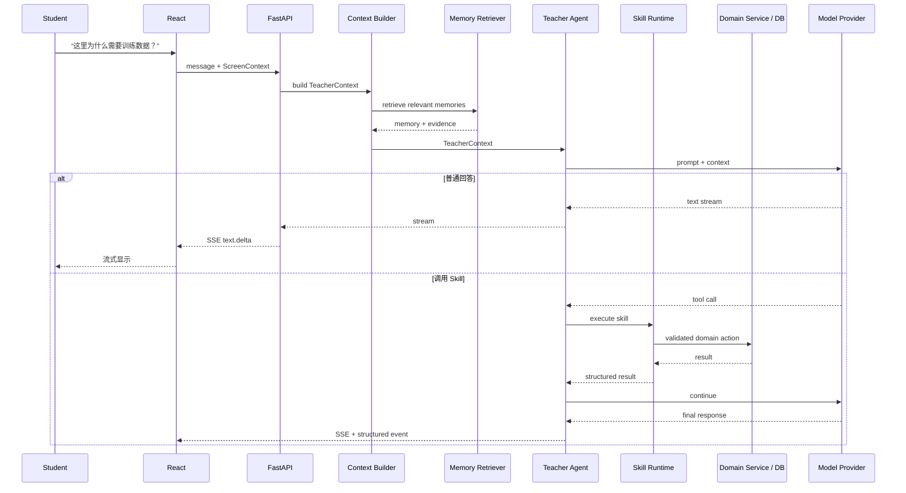

TeacherContext：

```text
TeacherContext
├── Student
├── TeacherRole
├── CurrentScreen
├── Conversation
├── RelevantMemory
├── RecentLearning
└── RelevantKnowledge
```

CurrentScreen 至少包含：

```text
page_type
book_id
chapter_id
content_block_id
visible_section
selected_text
```

---

# 10. Quiz Skill 架构

Quiz Skill 不是普通 Prompt 文件，而是完整的结构化能力：

```text
QuizSkill
├── InputSchema
├── Prompt
├── OutputSchema
├── Validator
├── RuleChecker
├── Reviewer
└── Version
```

流程：

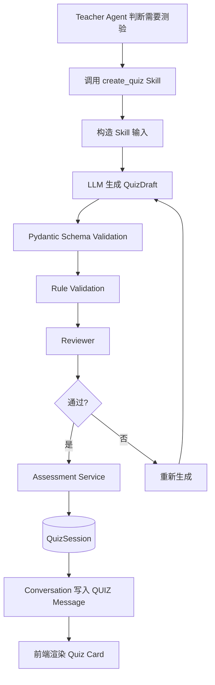

数据库至少：

```text
quiz_sessions
quiz_questions
quiz_answers
quiz_interactions
```

可额外保留 `questions_snapshot` 用于历史回放。

QuizInteraction：

```text
HINT_REQUEST
HINT_RESPONSE
QUESTION_ASK
TEACHER_REPLY
ANSWER_SUBMIT
ANSWER_RESULT
```

---

# 11. 聊天式答题流程

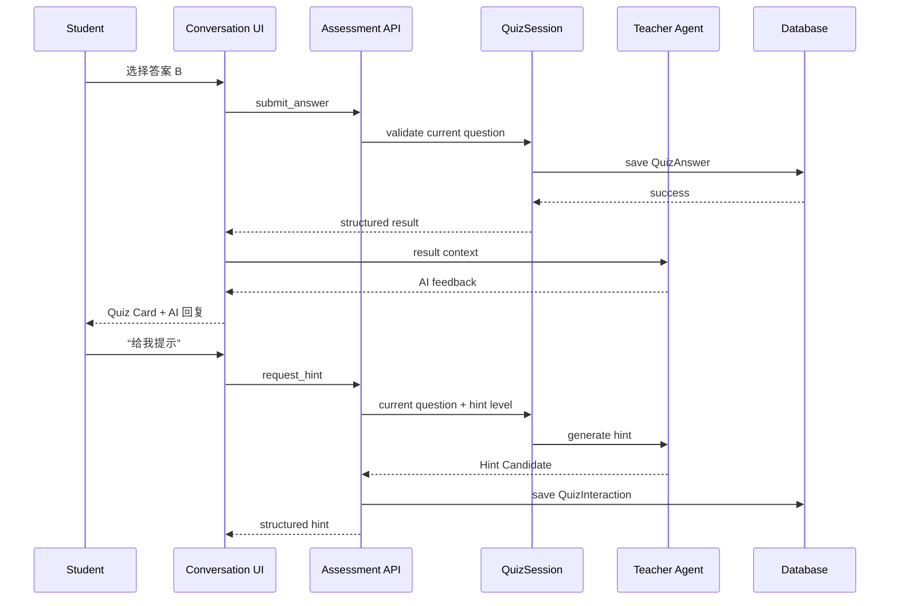

---

# 12. Memory 架构

建议五层记忆：

```text
Conversation Memory
Profile Memory
Preference Memory
Learning Memory
Episodic Memory
```

稳定画像必须关联 `MemoryEvidence`。

写入流程：

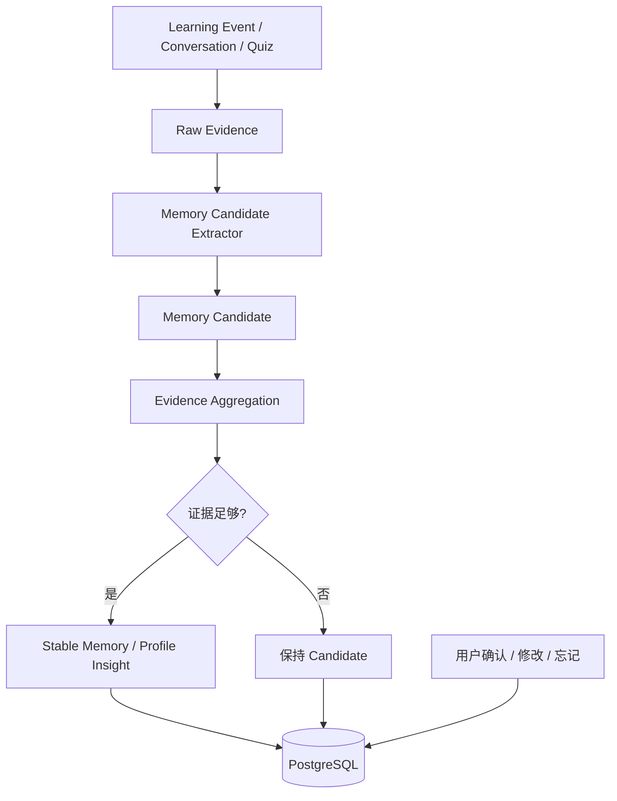

读取流程：

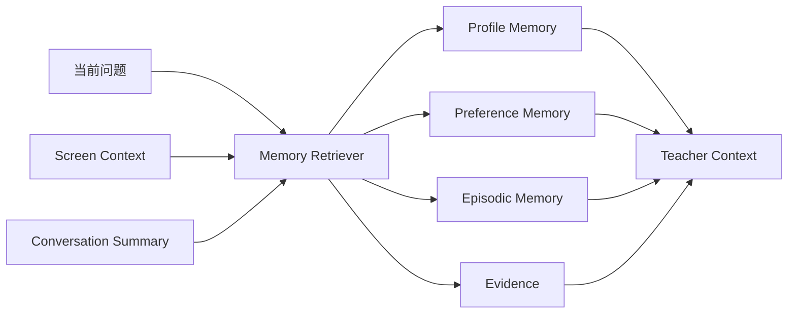

`xiaoming.agent.md` 只作为 View / Export：

```text
Structured Memory / Evidence / ProfileInsight
↓
Agent Profile Renderer
↓
xiaoming.agent.md
```

---

# 13. 总体实施阶段

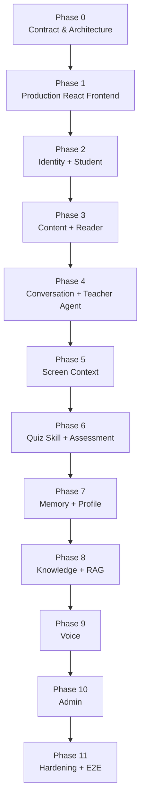

---

# 14. Phase 0 — Prototype → Architecture Contract

## 目标

把需求与原型转成正式工程合同。

## 产出

```text
docs/
├── contracts/
│   ├── page-map.md
│   ├── ui-behavior.md
│   └── api-contract.md
├── architecture/
│   ├── domain-model.md
│   ├── teacher-agent.md
│   ├── teacher-context.md
│   ├── memory.md
│   ├── quiz-skill.md
│   └── database-design.md
└── plans/
    └── v3-implementation-plan.md
```

## 任务

- 把原型分成 Visual Contract / Interaction Contract / Mock Data / Mock Logic；
- 建立页面地图；
- 定义 Domain；
- 定义 API；
- 定义数据库设计；
- 定义 Teacher Agent；
- 定义 Quiz Skill；
- 定义 Memory Pipeline。

## 不做

- 不写完整业务代码；
- 不开始最终数据库 migration；
- 不实现 Teacher Agent。

## 验收

原型中的每个行为都能映射到明确 Domain / API / Service。

## Commit

```text
docs: define V3 architecture contracts
```

---

# 15. Phase 1 — Production React Frontend

## 目标

把当前单文件 HTML 正式 React 化，视觉与交互尽量保持一致。

## 页面

```text
/home
/library
/books/:bookId
/learn/:bookId/:chapterId
/quizzes
/quizzes/:quizId
/profile
/settings
```

## 本阶段服务

```text
MockStudentService
MockContentService
MockConversationService
MockQuizService
MockMemoryService
```

## 必须完成

- Router；
- Design Tokens；
- CompanionLayer；
- ConversationPanel；
- VoiceOverlay；
- ScreenContextProvider；
- Message Renderer；
- Quiz Card；
- Profile；
- Empty / Loading / Streaming / Error 状态。

## 测试

Vitest：Store、Hook、Message Renderer、Quiz Card。  
Playwright 黄金路径：

```text
首页 → 书库 → Reader → 点桌虫 → 多轮聊天 → 生成 Quiz → 答题 → 历史答卷 → Profile
```

## 验收

纯前端版本完整跑通核心产品体验。

## Commit

```text
feat(frontend): implement V3 production UI with mock services
```

---

# 16. Phase 2 — Identity + Student

## Domain

```text
User
StudentProfile
StudentPreference
TeacherRoleSelection
```

## API

```text
POST /auth/login
POST /auth/logout
GET /me
PATCH /me
GET /me/preferences
PATCH /me/preferences
```

## Database

```text
users
student_profiles
student_preferences
```

## 验收

刷新页面后个人资料、年级、偏好、AI 教师选择仍保持。

## Commit

```text
feat(identity): add student identity and profile domain
```

---

# 17. Phase 3 — Content + Reader

## Domain

```text
Book
Chapter
ContentBlock
KnowledgePoint
BookProgress
LearningSession
LearningEvent
```

## API

```text
GET /books
GET /books/{id}
GET /books/{id}/chapters
GET /chapters/{id}
POST /learning-sessions
POST /learning-events
```

## Database

```text
books
chapters
content_blocks
knowledge_points
chapter_knowledge_points
book_progress
learning_sessions
learning_events
```

## LearningEvent 示例

```text
CHAPTER_OPENED
CONTENT_VIEWED
TEXT_SELECTED
AI_EXPLAIN_REQUESTED
CHAPTER_COMPLETED
```

## 验收

重新登录后，“继续学习”能够恢复到上次位置。

## Commit

```text
feat(content): add books reader and learning progress
```

---

# 18. Phase 4 — Conversation + Teacher Agent

## Domain

```text
Conversation
Message
ConversationSummary
TeacherRole
```

## API

```text
POST /conversations
GET /conversations
GET /conversations/{id}
POST /conversations/{id}/messages
```

消息输出采用 SSE。

## 必须实现

- PersonaEngine；
- ContextBuilder；
- ConversationManager；
- SkillRegistry；
- ModelGateway；
- 多轮 Conversation Context；
- Conversation Summary。

## 验收示例

```text
学生：监督学习是什么？
AI：……
学生：那标签呢？
AI：这里的“标签”指刚才监督学习中……
```

## Commit

```text
feat(agent): add persistent conversations and teacher agent runtime
```

---

# 19. Phase 5 — Screen Context

## 前端

正式实现统一 `ScreenContextProvider`。

## Context

```text
page_type
book_id
chapter_id
content_block_id
visible_section
selected_text
```

## 原则

Screen Context 是当前交互上下文，不直接成为长期事实；只有有意义的行为才转成 LearningEvent。

## 验收

用户选中“训练数据”后说“这个是什么意思？”，AI 能直接理解指代。

## Commit

```text
feat(context): connect live screen context to teacher agent
```

---

# 20. Phase 6 — Quiz Skill + Assessment

## Domain

```text
QuizSession
QuizQuestion
QuizAnswer
QuizInteraction
```

## Skill

```text
create_quiz
request_quiz_hint
```

## API

```text
POST /quizzes
GET /quizzes
GET /quizzes/{id}
POST /quizzes/{id}/answers
POST /quizzes/{id}/hint
```

## 要求

- 题目必须结构化；
- Schema Validation；
- Rule Validation；
- Reviewer；
- Snapshot；
- 答案提交幂等；
- Hint 分级；
- QuizInteraction 可回放。

## 验收

```text
聊天中出题
→ 答题
→ 请求提示
→ 保存 QuizSession
→ 测验历史
→ 查看当时题目和提示
```

## Commit

```text
feat(assessment): add structured quiz skill and persistent quiz sessions
```

---

# 21. Phase 7 — Memory + Learning Profile

## Domain

```text
StudentMemory
MemoryCandidate
MemoryEvidence
StudentEpisode
ProfileInsight
```

## API

```text
GET /memories
PATCH /memories/{id}
DELETE /memories/{id}
POST /memories/{id}/confirm
GET /profile-insights
GET /profile-insights/{id}/evidence
```

## 用户控制

```text
正确
不完全正确
修改
忘记这条
```

## Profile 输出

禁止主观百分比分数。

采用：

```text
偏弱
一般
较稳定
较强
仍需观察
```

并附 Evidence。

## 验收

用户点击“为什么你觉得我应用迁移仍需观察？”时，系统能展示真实证据。

## Commit

```text
feat(memory): add evidence-based long-term student memory
```

---

# 22. Phase 8 — Knowledge + RAG

两套知识体系：

```text
Curriculum Content
+
Reference Knowledge
```

Pipeline：

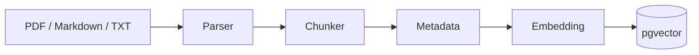

检索：

```text
Question + Current Chapter + Grade
↓
Embedding
↓
Vector Search
↓
Top K
↓
Teacher Agent
```

必须保存 `source_ids`。

## Commit

```text
feat(knowledge): add curriculum-aware RAG and source tracing
```

---

# 23. Phase 9 — Voice

## ASR

```text
Browser Microphone
→ WebSocket
→ Speech Gateway
→ ASR Provider
→ Partial Transcript
→ Final Transcript
```

Final Transcript 作为普通 Conversation Message。

## TTS

```text
Teacher Response
→ TTS
→ Audio Stream
→ Companion Speaking State
```

状态：

```text
IDLE
LISTENING
THINKING
SPEAKING
ERROR
```

## 验收

```text
说话 → 字幕 → AI 回答 → TTS → 角色说话状态
```

## Commit

```text
feat(voice): add contextual ASR and TTS conversation
```

---

# 24. Phase 10 — Admin

只做轻量内容管理。

页面：

```text
/admin
/admin/books
/admin/books/:id
/admin/resources
/admin/teacher-roles
```

功能：

- Book / Chapter / ContentBlock；
- KnowledgeResource；
- 来源与 License；
- TeacherRole；
- Persona；
- Sprite；
- Voice；
- 发布 / 下架。

不做：教师端、班级、作业、批改。

## Commit

```text
feat(admin): add lightweight content and teacher role console
```

---

# 25. Phase 11 — Production Hardening + E2E

## 黄金 E2E

```text
学生登录
↓
首页继续学习
↓
进入 Reader
↓
选中文字
↓
问霜铃
↓
连续上下文
↓
语音提问
↓
Quiz Skill
↓
故意答错
↓
分层提示
↓
历史答卷
↓
Memory 更新
↓
Learning Profile
↓
解释画像依据
```

## 非功能验收

- 1280×720；
- 1440×900；
- Mobile 基本可用；
- Keyboard / Focus；
- Companion 不遮挡；
- Slow Network；
- Provider Failure；
- Redis Restart；
- Fresh DB Migration；
- Existing DB Upgrade；
- Docker Cold Start。

## 安全

- Secret 不进前端；
- Secret 不提交 Git；
- Cookie / CORS / CSRF；
- Rate Limit；
- Log 脱敏；
- Prompt Injection 边界；
- Admin Auth。

## Commit

```text
chore(release): harden V3 for competition delivery
```

---

# 26. 生产运行主流程

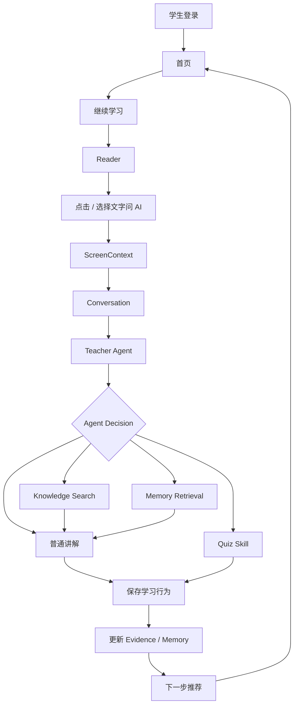

---

# 27. API 资源建议

```text
/auth
/me
/me/preferences
/teacher-roles
/books
/books/{book_id}
/books/{book_id}/chapters
/chapters/{chapter_id}
/learning-sessions
/learning-events
/conversations
/conversations/{conversation_id}
/conversations/{conversation_id}/messages
/quizzes
/quizzes/{quiz_id}
/quizzes/{quiz_id}/answers
/quizzes/{quiz_id}/hint
/memories
/memories/{memory_id}
/profile-insights
/knowledge/resources
/admin/*
```

---

# 28. 推荐数据库表组

## Identity

```text
users
student_profiles
student_preferences
```

## Teacher

```text
teacher_roles
student_teacher_roles
```

## Content

```text
books
chapters
content_blocks
knowledge_points
chapter_knowledge_points
```

## Learning

```text
learning_sessions
learning_events
book_progress
```

## Conversation

```text
conversations
messages
conversation_summaries
```

## Assessment

```text
quiz_sessions
quiz_questions
quiz_answers
quiz_interactions
```

## Memory

```text
student_memories
memory_candidates
memory_evidence
student_episodes
profile_insights
```

## Knowledge

```text
knowledge_resources
knowledge_chunks
```

---

# 29. Mock → Real API 替换策略

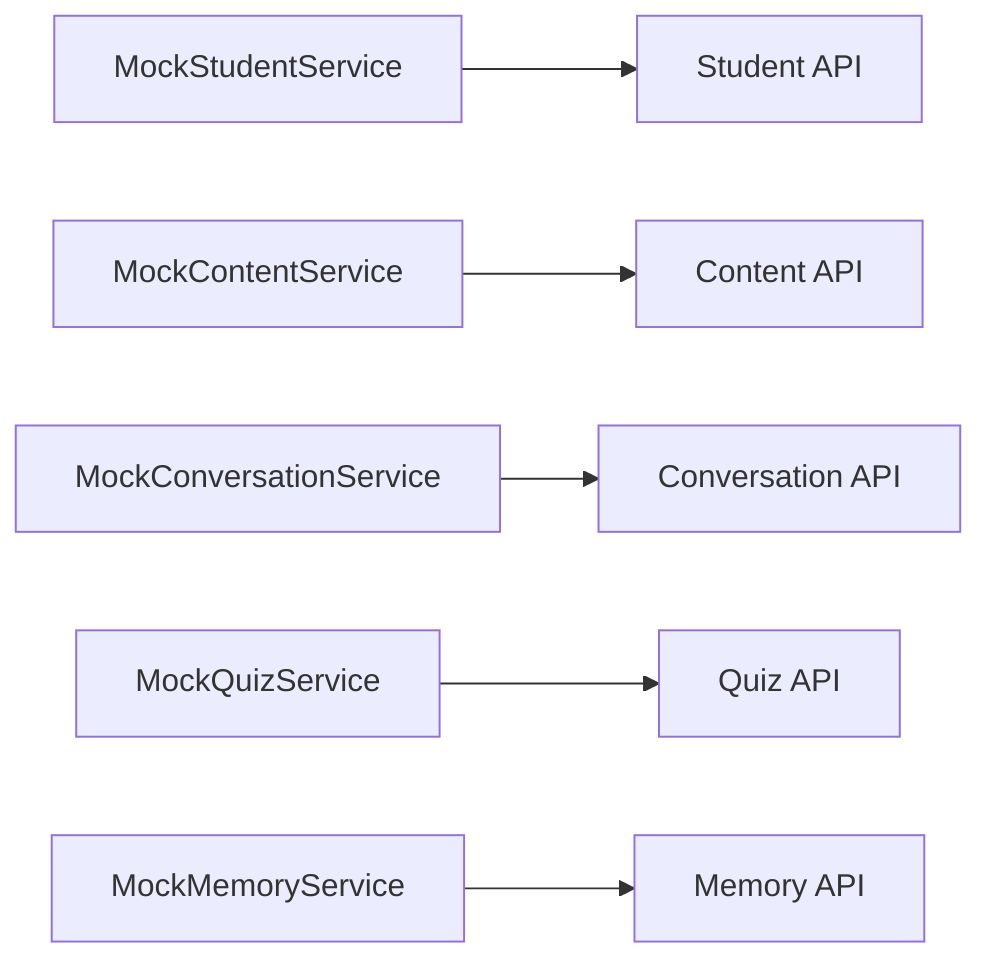

原则：**一次只替换一个领域服务**，不要一次删除全部 Mock。

---

# 30. 每阶段统一执行模板

每个 Agent 开工前：

1. 阅读需求总纲；
2. 阅读当前权威架构文档；
3. 阅读本 Phase；
4. 检查 Git 状态；
5. 写清文件范围；
6. 写清本轮“不做什么”。

执行过程：

```text
Requirement / Root Cause
↓
Minimal Architecture Change
↓
Implementation
↓
Targeted Tests
↓
Full Regression
↓
Acceptance
↓
Report
```

每阶段报告必须包含：

- 修改文件；
- 新增文件；
- Migration；
- API；
- Tests；
- E2E；
- 未完成项；
- 风险；
- Git status；
- diff stat。

完成后停止，等待人工确认，再进入下一阶段。

---

# 31. Agent 禁止事项

禁止一次要求 Agent：

> “把整个 V3 项目全部完成。”

同时禁止：

- 巨型一次性重构；
- 没 Contract 就直接改数据库；
- LLM 直接修改稳定用户画像；
- Chat 只保存在浏览器；
- Quiz 用 Markdown 文本解析；
- 历史答卷重新生成；
- Redis 作为业务唯一事实源；
- `.agent.md` 作为真实数据库；
- 无证据生成能力百分比分数；
- 为了“高级”拆微服务；
- 为了“AI”拆几十个 Agent。

---

# 32. Definition of Done

## Product

- 学生端完整闭环；
- 全局 Companion；
- 当前页面感知；
- 连续 Conversation；
- Voice；
- Quiz Skill；
- 历史答卷；
- Long-term Memory；
- Learning Profile；
- Library / Reader；
- 轻量 Admin。

## Engineering

- Frontend tests green；
- Backend tests green；
- E2E green；
- Fresh migration green；
- Upgrade migration green；
- Docker cold start green。

## AI

- Provider 可切换；
- Skill 可验证；
- Memory 可解释；
- Quiz Schema 稳定；
- Provider Failure 有降级。

## UX

- 1280×720 完整；
- 1440×900 完整；
- Companion 不挡操作；
- 用户能感知 AI 当前参考内容；
- Profile 不出现虚假精确分数。

---

# 33. 建议比赛 7 分钟展示链

```text
00:00  首页 + AI 教师
00:40  继续学习
01:20  Reader + Screen Context
02:00  选中文字问霜铃
02:40  多轮上下文
03:20  语音提问
04:00  Quiz Skill
04:40  故意答错 + 分层提示
05:30  历史答卷
06:00  AI Learning Profile
06:30  “为什么这样判断我？”
07:00  长期陪伴总结
```

最终要让评委看到：

> 霜铃不是聊天机器人，而是一个长期理解学生、理解当前学习场景、能够讲解、测评、记忆并持续适应的 K12 AI 数字教师。

---

# 34. 最终开发顺序总结

```text
Phase 0  Contract & Architecture
Phase 1  Production React Frontend + Mock Services
Phase 2  Identity + Student
Phase 3  Content + Reader
Phase 4  Conversation + Teacher Agent
Phase 5  Screen Context
Phase 6  Quiz Skill + Assessment
Phase 7  Memory + Learning Profile
Phase 8  Knowledge + RAG
Phase 9  Voice
Phase 10 Admin
Phase 11 Hardening + E2E + Competition Delivery
```

---

# 35. 最重要的执行原则

> **不要为了后端架构牺牲已经确定的产品体验。**

当前 Open Design 原型是：

# UI / Interaction Reference Baseline

产品需求总纲是：

# Product Requirements Baseline

后续每一个 Domain、API、Database、Agent、Skill、Memory、Test 都必须能够回答：

> “它最终服务了原型中的哪一个真实学生体验？”

如果回答不了，就不应该在当前阶段加入。

---

# 36. Hermes 自动编排执行协议

本项目采用：

# Hermes → Herdr → Codex

自动协同开发模式。

Hermes 是整个项目的唯一总控 Agent。

Codex 是主要 Implementation Agent。

Herdr 是 Hermes 调用 Codex 的任务执行通道。

---

## 36.1 Hermes 的目标

Hermes 的任务不是只生成开发计划。

Hermes 必须根据本文件定义的完整开发路线：

```text
读取当前状态
↓
制定当前有限任务
↓
通过 Herdr 发布给 Codex
↓
等待 Codex 完成
↓
独立验收
↓
根据验收结果处理
↓
发布下一任务
```

循环执行，直到当前 Phase 全部完成。

然后执行 Phase Gate。

Phase Gate PASS 后，再进入下一 Phase。

最终持续推进直到整个项目 Definition of Done 完成。

---

# 37. 标准自动执行循环

每一个任务必须严格遵循：

```text
Hermes 读取当前状态
        ↓
Hermes 制定 Task N
        ↓
Hermes 通过 Herdr 发布给 Codex
        ↓
Codex 实施
        ↓
Codex 自测
        ↓
Codex 返回执行报告
        ↓
Hermes 独立 Review
        ↓
┌─────────────────────────────────┐
│ PASS                            │
│ → 更新进度                      │
│ → 发布下一任务                  │
├─────────────────────────────────┤
│ PASS WITH FOLLOW-UP             │
│ → 记录非阻塞问题                │
│ → 继续下一任务                  │
├─────────────────────────────────┤
│ FAIL                            │
│ → 生成 Fix Task                 │
│ → Herdr 再调用 Codex 修复       │
│ → 再次验收                      │
├─────────────────────────────────┤
│ BLOCKED                         │
│ → 停止相关路径                  │
│ → 记录 Blocker                  │
│ → 判断是否存在可继续的独立任务  │
└─────────────────────────────────┘
```

禁止跳过 Hermes Review。

---

# 38. Hermes 发布任务规则

Hermes 不得直接发布：

> 完成整个项目。

也不得直接发布：

> 完成整个 Phase。

Hermes 必须将每个 Phase 拆成有限、独立、可验收的 Task。

例如：

```text
Phase 6 — Quiz

6-A Quiz Domain
6-B Database Migration
6-C Quiz Skill Schema
6-D Validator / Reviewer
6-E Assessment API
6-F Conversation Integration
6-G Frontend Quiz Card
6-H Quiz History
6-I Full Acceptance
```

每个任务完成并验收后，才允许进入下一个任务。

---

# 39. Codex Task 固定格式

Hermes 每次通过 Herdr 发布给 Codex 的任务必须包含：

```text
# Context

当前项目状态
当前 Phase
当前 Task
最近已验收 Commit

# Goal

本任务唯一目标

# Scope

允许修改的模块 / 文件

# Requirements

必须实现的行为

# Architecture Constraints

必须遵守的架构边界

# Frontend

前端工作

# Backend

后端工作

# Database

Migration / Schema 工作

# Agent / Skill

涉及的 AI 工作

# Tests

必须新增和执行的测试

# Acceptance Criteria

Hermes 后续验收依据

# Out of Scope

明确禁止修改的内容

# Final Report

Codex 必须返回：
- files changed
- diff stat
- tests
- runtime result
- migration
- remaining issues
- git status
```

任务必须能够脱离聊天上下文独立执行。

---

# 40. Codex 返回后 Hermes 必须独立验收

Hermes 不得把 Codex 的：

> “全部测试通过”

直接视为 PASS。

Hermes 必须尽可能自行核验：

```text
git status --short
git diff --stat
git diff
git log
```

并根据当前 Task 检查：

- 实际代码；
- 测试；
- Migration；
- API；
- Runtime；
- Architecture；
- UI；
- 文档。

必要时自行重新运行：

- targeted tests；
- regression；
- build；
- lint；
- E2E；
- migration；
- smoke tests。

---

# 41. FAIL 自动返工机制

如果任务 FAIL：

Hermes 不允许：

> “重新完成这个 Phase。”

必须生成：

# Fix Task

Fix Task 只针对已经确认的失败原因。

例如：

```text
Root Cause

Expected Behavior

Actual Behavior

Allowed Files

Required Fix

Regression Test

Acceptance
```

通过 Herdr 再次调用 Codex。

修复完成以后：

```text
Codex
↓
Hermes Review
↓
PASS
```

才能继续。

---

# 42. Phase Gate

一个 Phase 的所有 Task 都 PASS 后：

Hermes 必须执行独立的：

# Phase Gate

Phase Gate 至少包括：

```text
Requirements Review

Architecture Review

Full Regression

Git Review

Documentation Review

Cross-module Integration

Acceptance Criteria

Outstanding Follow-ups
```

结果必须为：

```text
PHASE PASS

PHASE FAIL

PHASE BLOCKED
```

只有：

# PHASE PASS

才能进入下一 Phase。

---

# 43. Phase Gate 后自动继续

默认情况下：

如果：

```text
Phase Gate = PASS
```

且：

- 没有 Architecture Decision Needed；
- 没有 HUMAN_VERIFY；
- 没有破坏性操作需要用户确认；
- 没有外部资源需要用户提供；

Hermes 可以自动开始下一 Phase。

不需要用户每个 Phase 手动再次发送“继续”。

---

# 44. 必须暂停并询问用户的情况

即使处于自动模式，遇到以下情况 Hermes 必须暂停。

## Architecture Decision Needed

例如：

```text
方案 A 和方案 B 都合理，
会显著影响后续架构。
```

---

## HUMAN_VERIFY

例如：

- UI 主观体验；
- 比赛彩排；
- 教学内容审核；
- 真人语音体验。

---

## Destructive Operation

例如：

- 删除大量已有数据；
- 重写已经验收的核心架构；
- 强制重置数据库；
- 删除已稳定模块。

---

## Secret / External Credential

例如：

- 阿里云 Key；
- DeepSeek Key；
- GitHub Secret；
- 对象存储凭证。

---

## Product Requirement Conflict

如果代码、Prototype 与产品需求存在无法自行判断的冲突：

必须暂停。

---

# 45. 不需要暂停的普通事项

以下问题 Hermes 自行处理，不需要询问用户：

- 普通编译错误；
- 单元测试失败；
- lint；
- 类型错误；
- 小范围 API bug；
- Migration bug；
- Codex 实现遗漏；
- 明确 Root Cause 的代码缺陷；
- 当前 Phase 内部的非架构性实现选择。

这些应继续：

```text
Fix Task
→ Codex
→ Review
```

---

# 46. Current Phase 自动维护

Hermes 必须维护：

```text
docs/plans/current-phase.md
```

格式建议：

```text
Current Phase:

Current Task:

Last Accepted Commit:

Completed Tasks:

Current Task Status:

Blocked:

Follow-ups:

Next Planned Task:

Last Hermes Review:
```

每次 Task PASS 后更新。

每次 Phase Gate PASS 后更新。

---

# 47. 上下文恢复协议

Hermes 不能依赖长期聊天上下文。

每次：

- 新会话；
- resume；
- compact；
- 模型切换；
- 意外中断；

恢复时必须读取：

```text
1. 本执行总路线
2. current-phase.md
3. Product Requirements
4. 当前阶段 Architecture / Contract
5. git status
6. git log
7. 当前代码
```

然后从：

```text
Current Task
```

继续。

禁止凭记忆猜测项目进度。

---

# 48. 文档也是开发任务

本路线中的 `.md` 文件不是一次性计划文档。

Hermes 必须确保 Codex 在实现过程中同步维护：

- architecture；
- API contract；
- database design；
- current phase；
- acceptance；
- traceability。

但禁止：

> 为了文档而创建不存在的实现。

原则：

```text
实现改变
→ 文档同步
```

---

# 49. Hermes 自动执行的最终停止条件

Hermes 持续：

```text
发布任务
→ 验收
→ 发布任务
→ 验收
```

直到：

# Phase 12 PASS

并且：

```text
Product DoD
Engineering DoD
AI DoD
UX DoD
CI DoD
Competition Acceptance
```

全部满足。

然后建立：

```text
competition-ready-v3
```

稳定基线。

完成以后停止自动开发。

---

# 50. 自动执行最高原则

Hermes 必须始终遵循：

> **自动推进不等于自动放宽验收。**

Herdr 能自动调用 Codex，只是减少人工搬运任务。

它不能改变：

```text
Plan
→ Execute
→ Verify
→ Accept
```

这个顺序。

无论自动执行多少任务：

# 每一次 Codex Implementation 后都必须经过 Hermes Acceptance。

不得：

```text
连续发布 5 个任务
→ 最后统一验收
```

必须：

```text
Task A
→ Execute
→ PASS

Task B
→ Execute
→ PASS

Task C
→ Execute
→ PASS
```

---

# 51. Hermes 的最终身份

Hermes 是：

```text
Project Guardian
+
Lead Architect
+
Planner
+
Reviewer
+
QA
+
Codex Orchestrator
```

Codex 是：

```text
Implementation Agent
```

Herdr 是：

```text
Task Dispatch / Execution Bridge
```

三者职责不得混淆。