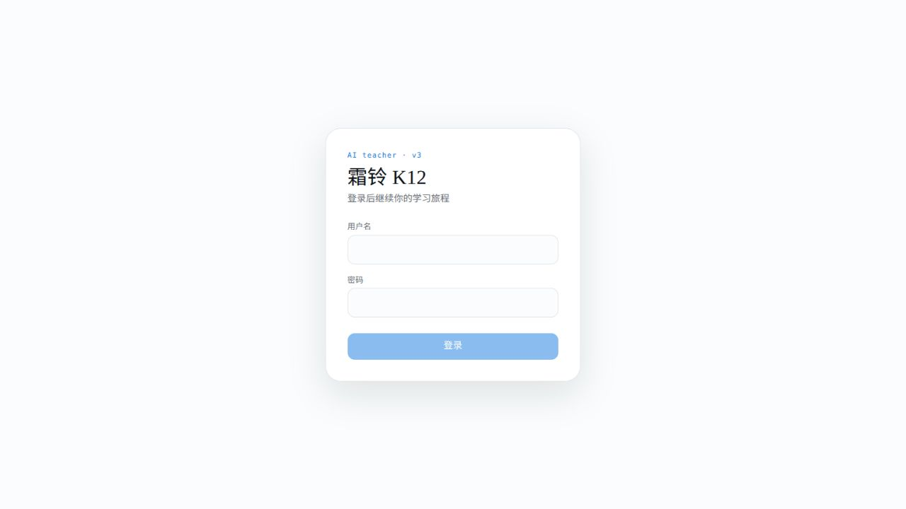

# 霜铃项目评审与优化建议

日期：2026-09-06。详细执行入口：[plan.md](plan.md)；派发与状态：[todo.md](todo.md)。

## 判断

项目已有较完整的功能基础，但“功能存在”与“学生能够稳定完成一次有价值的学习”之间还有明显距离。下一版本应该把课程发现、阅读、练习、错题讲解、复习和继续学习串好，同时优先修正内容可见性与数据可信度。

不建议此时增加家长端、教师端、排行榜、付费或新框架。实际语料是 AI 与计算通识，建议明确以此作为当前产品范围，而不是暗示所有K12学科都能提供成熟教学。

## 优先修的六类问题

### 1. 内容发现与访问边界

书库后端默认20条，前端只取data并丢掉分页meta；当前文件语料有25本。只要发布内容超过20本，现有入口就不能完整展示；在第一页之外的课程也无法被前端本地搜索命中。

修法：保留API信封、后端搜索后分页、前端加载更多，筛选变化重置页码。不要把limit改成100就宣称解决。

另外，学生书籍列表可传DRAFT/ARCHIVED，章节详情没有完整的父书/章节发布状态检查。这是需要优先处理的代码级访问边界缺口；本轮没有用真实学生账号运行越权请求，不宣称已经发生泄漏。

证据：`backend/app/modules/content/router.py:22`、`:26`；`service.py:100`、`:208`；`frontend/src/shared/api/http.ts:74`；`api-content-service.ts:171`。对应T02–T05。

### 2. “失败”被显示成“没有”

首页、书库和测验多个catch把数据清空；成长页首次加载依赖Promise.all，任意接口失败可能导致prefs一直为空，页面持续骨架；管理统计也会持续“正在加载”。学生会以为自己的学习记录没了，或无法知道如何恢复。

修法：统一加载、成功空态、失败三类状态，局部失败局部重试；刷新失败保留已有数据。首页和成长页不要一个次要接口失败拖垮整个页面。

证据：`frontend/src/pages/profile/ProfilePage.tsx:226`及各页面load函数。对应T07–T09、T21。

### 3. 阅读材料并不完整

Reader的FIGURE实际是“图解占位”，IMAGE没有渲染分支。语料结构校验虽然通过，但FIG格式只包含图像描述与图注，没有实际图源，因此光调整CSS解决不了。

修法：补齐图像资源契约、校验、导入与前端渲染；先精修小学/初中/高中各一个样板章节并配真实图解，再推广到全部内容。保留替代文本和加载失败反馈。

证据：`frontend/src/pages/reader/ReaderPage.tsx:158`；`backend/data/library/README.md`。对应T10–T12、T22。

### 4. 学习与复习没有明确收尾

阅读滚到末块就发完成事件，最后一章末块就发整书完成；这不足以说明所有章节已经学完。答卷每题的“再问老师”实际都调用“再出一道类似的题”，也没有显式传当前题目和作答ID。

修法：明确“完成本章”，全书完成由章节完成集合判定；结束卡给出练习/下一章；答卷分开“讲解这道题”和“再练一道”，由后端读取当前用户的题目快照。首页用统一规则决定继续练习、错题回顾或继续阅读。

证据：Reader的IntersectionObserver；`frontend/src/pages/quizzes/QuizDetailPage.tsx:62`。对应T13–T16。

### 5. 前端细节需要形成统一规则

源码中多处9–11px文本和操作、桌面固定导航、拥挤的对话工具行，以及“骨架”“Phase”“技能版本”等开发文案。当前学段适配主要修改root字号，不能修正所有固定px小字。登录后页面未完成视觉实测，因此这里区分确定的源码问题与窄屏待验证风险。

修法已在plan第5节写具体：正文16px、阅读18px起、次要信息14px；儿童操作区域44/48px；窄屏底部四项导航；移动阅读目录抽屉；对话面板收纳历史操作并避开键盘；首页只保留一个主要学习行动。保留现有浅色与蓝色设计方向。

### 6. 技术通过还不能证明教学质量

已有测试是有价值的基础，但真实教学、模型费用和长对话行为需要独立验证。当前长对话会把摘要与全量历史一起发送，压缩没有起到限制输入的作用；usage中部分token字段实际用字符数计算。

修法：摘要有明确覆盖边界，输入仅含摘要与未覆盖的近期消息；区分真实token和估算。建立固定教学案例和审校题源，验证答案正确、年龄适配、引用可核查、讲解对题。现有模板“是不是本章的内容”可以做基础兜底，但不能当作成熟的概念应用评估。

证据：`backend/app/modules/conversation/service.py:536`、`:544`、`:801`；`backend/app/modules/quiz/chapter_source.py`。对应T20、T22–T25。

## 建议顺序

1. M0：访问边界、账号隔离、课程分页、失败状态、图像链路。
2. M1：完成语义、错题讲解、复习推荐、首页聚焦、移动端和对话体验。
3. M2：管理处理状态、样板课审校、真实教学评测、回归矩阵与试用准备。

详细计划约3万字符，26项任务，并标明复杂任务的子任务顺序。每项都有文件、依赖、实施要求、验收和测试场景；另有任务交接模板。估算17–28人日另加约25%不确定性，需用首批任务结果重估，不能把agent数量简单换算成等比例提速。

## 本轮实际验证

- 前端Vitest：38文件、191项通过；生产build通过。
- 后端provider/embedding：12项通过；不代表后端全量通过。
- 文件语料校验：25本、56篇知识文档，结构校验通过。
- 登录页已截图并打开检查；本机health返回ok。
- 没有对用户开发库运行全量pytest/seed/CI；没有消耗真实模型额度；没有修改业务代码。

浏览器步骤：1. 登录表单可见，层级清楚；2. 登录提交受自动审批拦截；3. 登录后的首页→书库→阅读→练习→成长未运行。登录页缺少账号获取/求助说明是产品建议，不代表登录故障。

自动审批拒绝本地演示账号登录，理由是账号凭据未获得用户明确授权；授权问题已发出，尚未收到答复。内部页面结论基于代码，完整视觉与交互检查明确列入T01；没有以旧截图或虚构运行结果替代。
