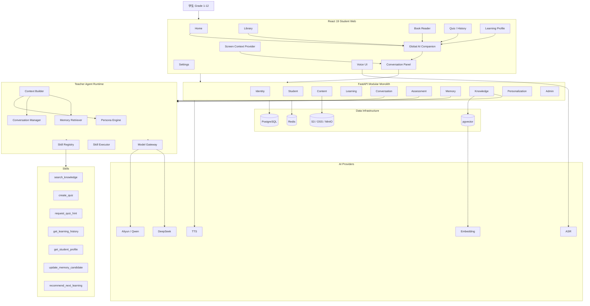

# 霜铃 · K12 AI 数字教师 V3
# Hermes × Codex 多 Agent 协同开发总路线

> 版本：v1.0  
> 日期：2026-08-19  
> 项目阶段：Greenfield / 从零构建  
> 项目目录：`K12-Learning-platform`  
> 核心模式：**Hermes 负责规划、审查、验收、纠偏；Codex 负责具体实现。**
>
> 本文档是整个 V3 项目的 **执行总控文件（Execution Baseline）**。  
> 后续 Hermes 每次开始新会话、压缩上下文、恢复任务或准备下发 Codex 任务时，都必须优先读取本文件，再读取仓库中的产品需求、项目架构和 UI 原型，禁止仅凭聊天上下文继续工作。

---

# 目录

1. 项目当前起点
2. 项目核心目标
3. 基线文件与优先级
4. Hermes 与 Codex 的角色分工
5. 多 Agent 协同原则
6. Git 与工作区策略
7. 仓库正式目录结构
8. 总体阶段划分
9. Phase 0：项目初始化与基线固化
10. Phase 1：前端工程化与 UI 原型 React 化
11. Phase 2：学生身份与个人设置
12. Phase 3：书库、书籍、章节与阅读器
13. Phase 4：Conversation 与 Teacher Agent Runtime
14. Phase 5：Screen Context / 当前界面感知
15. Phase 6：Quiz Skill 与历史测验
16. Phase 7：长期记忆与 AI 学习画像
17. Phase 8：Knowledge Base 与 RAG
18. Phase 9：语音输入 / TTS
19. Phase 10：管理员端与内容管线
20. Phase 11：多 AI 教师角色与 Persona 管理
21. Phase 12：生产化、E2E、比赛交付
22. 每阶段 Hermes → Codex 下发协议
23. Codex → Hermes 回报协议
24. Hermes 验收协议
25. 缺陷处理与返工机制
26. 文档维护规则
27. 数据与 Mock 策略
28. AI / Agent 安全边界
29. 测试策略
30. CI/CD 与质量门禁
31. Definition of Done
32. 项目最终架构图
33. 项目实现路径图

---

# 1. 项目当前起点

当前项目目录只保留少量基线资料，没有正式生产代码。

目录中目前主要包括：

- 产品需求总纲；
- 项目架构设计 / 项目架构说明；
- 详细开发实施路线；
- Open Design 生成的纯前端 UI/UX 原型；
- 可能存在的其他设计辅助文档。

当前 `shuangling-v3-prototype.html`：

**不是生产代码。**

它的定位是：

# UI / Interaction Reference Baseline

它用于约束：

- 页面结构；
- 视觉语言；
- 导航；
- 全局 AI 桌虫；
- Conversation Panel；
- Reader；
- Quiz Card；
- Quiz History；
- Learning Profile；
- Age Adaptation；
- Empty / Loading / Error State；
- 交互行为。

正式开发时必须把它拆成 React + TypeScript 工程，而不是继续在单 HTML 中堆业务。

---

# 2. 项目核心目标

产品核心定位：

> **一个从小学一年级到高中三年级，能够长期理解学生、记住学生、感知当前学习页面，并通过可交互 AI 数字教师持续陪伴学生学习的 K12 AI 学习平台。**

用户主体：

- 学生；
- Grade 1–12；
- 小学 / 初中 / 高中。

非核心用户：

- 管理员，仅用于内容和平台维护。

不做教师端，不做家长端，不做班级体系。

---

## 2.1 产品核心闭环

```text
学生进入平台
↓
首页看到当前学习状态
↓
进入书库 / 继续上次学习
↓
阅读书籍章节
↓
AI 教师感知当前页面
↓
学生文本 / 语音提问
↓
Teacher Agent 连续对话
↓
AI 讲解 / 提问 / 提示 / 鼓励
↓
调用 Quiz Skill 生成结构化测验
↓
学生在 Conversation 中交互式答题
↓
QuizSession 正式保存
↓
形成 Learning Event / Evidence
↓
长期记忆与学习画像更新
↓
AI 生成下一步建议
↓
学生继续学习
```

---

# 3. 基线文件与优先级

Hermes 和 Codex 每次工作前都必须先确定仓库根目录中的基线文件。

不要求文件名绝对固定，但必须按内容识别以下四类资料。

---

## 3.1 Product Requirements Baseline

内容包括：

- 产品定位；
- 用户；
- 多 AI 教师角色；
- Conversation 上下文；
- 长期记忆；
- Quiz Skill；
- 历史答卷；
- Screen Context；
- Voice；
- Admin；
- MVP 范围。

如果实现与产品需求冲突：

**优先遵循当前最新产品需求。**

---

## 3.2 Architecture Baseline

内容包括：

- 技术栈；
- Teacher Agent；
- Domain；
- API；
- Database；
- Memory；
- Quiz Skill；
- RAG；
- 数据边界。

如果代码与架构文档冲突：

- 开发中的阶段：先由 Hermes 判断是否架构需要更新；
- 已验收阶段：以当前已通过验收的代码 + 最新架构文档共同为准。

---

## 3.3 UI / Interaction Baseline

通常为：

`shuangling-v3-prototype.html`

用于约束：

- 页面视觉；
- 用户流程；
- AI 桌虫交互；
- Conversation；
- Reader；
- Quiz；
- Growth；
- Age Adaptation。

Codex 不得因为“实现方便”擅自把确认过的 UI 改成普通后台样式。

---

## 3.4 Execution Baseline

即当前本文档：

# `Hermes × Codex 多 Agent 协同开发总路线`

该文件定义：

- 当前做到哪一阶段；
- 下一阶段是什么；
- Hermes 如何规划；
- Codex 如何执行；
- 每阶段如何验收；
- 是否允许进入下一阶段。

---

# 4. Hermes 与 Codex 的角色分工

---

# 4.1 Hermes：项目总控 / Planner / Reviewer / QA

Hermes 不作为主要编码 Agent。

Hermes 的主要职责：

### 需求守护

检查：

- Codex 是否偏离产品定位；
- 是否漏掉 UI 原型的重要交互；
- 是否把 AI 教师退化成聊天框；
- 是否错误增加教师端等需求外功能。

### 架构规划

每个 Phase 开始前：

- 阅读基线；
- 阅读当前代码；
- 阅读上一阶段验收报告；
- 确认当前真实状态；
- 将 Phase 拆成 Codex 可执行任务。

### 任务下发

Hermes 应把一个 Phase 拆成：

```text
Task 1
Task 2
Task 3
...
```

每个任务必须：

- 范围明确；
- 文件范围明确；
- 验收标准明确；
- 禁止事项明确。

### Code Review

Codex 完成后 Hermes：

- 查看 Git Diff；
- 阅读关键代码；
- 阅读 Migration；
- 阅读 API；
- 检查测试；
- 检查文档更新。

### 验收

Hermes 负责决定：

```text
PASS
PASS WITH FOLLOW-UP
FAIL
BLOCKED
```

只有：

# PASS

才允许进入下一 Phase。

### 纠偏

如果 Codex：

- 过度设计；
- 添加无关技术；
- UI 跑偏；
- 修改范围过大；
- 测试不足；

Hermes 必须停止推进，要求返工。

---

# 4.2 Codex：Implementation Agent

Codex 是主要执行者。

职责：

- 创建工程；
- 写前端；
- 写后端；
- 写数据库 Migration；
- 实现 Agent Runtime；
- 实现 Skill；
- 写测试；
- 修 Bug；
- 执行命令；
- 验证程序；
- 提供 Diff 与测试结果。

Codex 不负责：

- 自行改变需求；
- 自行扩大 Phase；
- 擅自加入复杂架构；
- 自动进入下一 Phase。

---

# 5. 多 Agent 协同原则

整个项目采用：

```text
Hermes Plan
↓
Codex Execute
↓
Codex Verify
↓
Hermes Review
↓
Hermes Accept / Reject
↓
Commit / Baseline
↓
Next Phase
```

---

## 5.1 Hermes 不直接下发“大而泛”的命令

禁止：

> 把 Phase 6 全部完成。

推荐：

```text
Phase 6-A
Quiz Domain + Migration

Phase 6-B
Quiz Skill Draft / Validation

Phase 6-C
Quiz API

Phase 6-D
Conversation Quiz Message

Phase 6-E
Frontend Quiz Card

Phase 6-F
History + Detail

Phase 6-G
Full Acceptance
```

---

## 5.2 Codex 不得跨阶段

如果当前是 Phase 3：

允许：

- Content；
- Reader；
- BookProgress；
- LearningEvent。

禁止顺手：

- 实现长期记忆；
- 实现 RAG；
- 实现 Voice；
- 实现 Admin。

---

## 5.3 每阶段必须建立 Checkpoint

每个 Phase 完成：

```text
测试
↓
Hermes 验收
↓
Git Commit
↓
标记 Checkpoint
```

然后下一阶段。

---

# 6. Git 与工作区策略

建议初始化：

```bash
git init
git branch -M master
```

---

## 6.1 master

`master` 始终保存：

> 最近一个通过 Hermes 验收的稳定版本。

---

## 6.2 Codex 工作方式

推荐每个大 Phase 创建：

```text
phase/01-frontend
phase/02-identity
phase/03-content
...
```

如果使用单分支，也必须保证：

- 每个 Phase 独立 Commit；
- 工作区干净以后再开始下一阶段。

---

## 6.3 Commit 规范

推荐：

```text
docs:
feat(frontend):
feat(identity):
feat(content):
feat(agent):
feat(context):
feat(assessment):
feat(memory):
feat(knowledge):
feat(voice):
feat(admin):
test:
fix:
chore:
```

---

# 7. 仓库正式目录结构

Phase 0 初始化后目标：

```text
K12-Learning-platform/
│
├── README.md
├── .gitignore
├── .editorconfig
├── .env.example
├── docker-compose.yml
│
├── docs/
│   ├── README.md
│   │
│   ├── requirements/
│   │   └── 产品需求总纲.md
│   │
│   ├── architecture/
│   │   ├── system-architecture.md
│   │   ├── domain-model.md
│   │   ├── frontend-architecture.md
│   │   ├── backend-architecture.md
│   │   ├── teacher-agent.md
│   │   ├── teacher-context.md
│   │   ├── quiz-skill.md
│   │   ├── memory.md
│   │   ├── knowledge-rag.md
│   │   └── database-design.md
│   │
│   ├── contracts/
│   │   ├── page-map.md
│   │   ├── ui-behavior.md
│   │   ├── api-contract.md
│   │   └── traceability.md
│   │
│   ├── plans/
│   │   ├── development-roadmap.md
│   │   └── current-phase.md
│   │
│   └── acceptance/
│       └── README.md
│
├── prototypes/
│   └── shuangling-v3-prototype.html
│
├── frontend/
│
├── backend/
│
├── scripts/
│
└── infra/
```

---

# 8. 总体阶段划分

整个项目分为 13 个阶段：

```text
Phase 0
项目初始化 + Contract + Architecture

Phase 1
生产 React 前端 + Mock Services

Phase 2
Identity + Student Profile

Phase 3
Content + Books + Reader

Phase 4
Conversation + Teacher Agent

Phase 5
Screen Context

Phase 6
Quiz Skill + Assessment

Phase 7
Memory + Learning Profile

Phase 8
Knowledge Base + RAG

Phase 9
Voice

Phase 10
Admin

Phase 11
Multi Teacher Roles

Phase 12
Production Hardening + CI + E2E + Competition
```

---

# 9. Phase 0 — 项目初始化与基线固化

# 目标

将当前几个孤立文件变成一个正式可开发仓库。

并完成：

```text
Prototype
+
Requirements
+
Architecture
↓
Contracts
+
Domain
+
API
+
Database Design
```

---

## 9.1 Hermes 工作

Hermes：

1. 阅读根目录全部文件；
2. 判断每个文件作用；
3. 建立 Baseline 分类；
4. 审计 Prototype；
5. 检查需求冲突；
6. 输出 Phase 0 Codex 任务。

---

## 9.2 Codex 任务

### Task 0-A：仓库初始化

完成：

- Git；
- README；
- `.gitignore`；
- docs；
- prototypes；
- frontend；
- backend；
- scripts；
- infra。

移动现有文件到正确目录。

不得删除原始资料。

---

### Task 0-B：Prototype Audit

提取：

- Page Map；
- Visual Contract；
- Interaction Contract；
- Mock Data；
- Mock Logic。

---

### Task 0-C：Domain Model

正式定义：

```text
User
StudentProfile
StudentPreference
TeacherRole

Book
Chapter
ContentBlock
KnowledgePoint

LearningSession
LearningEvent
BookProgress

Conversation
Message
ConversationSummary

QuizSession
QuizQuestion
QuizAnswer
QuizInteraction

StudentMemory
MemoryCandidate
MemoryEvidence
StudentEpisode
ProfileInsight

Recommendation

KnowledgeResource
KnowledgeChunk

Admin
```

---

### Task 0-D：API Contract

仅设计，不实现。

---

### Task 0-E：Database Design

只进行逻辑 Schema。

此时不创建最终 Migration。

---

### Task 0-F：Architecture Diagrams

生成：

- Overall；
- Frontend；
- Backend；
- Teacher Agent；
- Quiz；
- Memory；
- RAG；
- Data。

---

### Task 0-G：Traceability

建立：

```text
Requirement
→ Prototype
→ Domain
→ API
→ Database
→ Phase
```

---

## 9.3 Hermes 验收

检查：

- 没有业务代码提前实现；
- 没有多 Agent 过度设计；
- Quiz / Memory / Conversation 都是一等 Domain；
- UI 功能没有漏；
- 没有为了“未来”创建大量无消费者表。

PASS 后 Commit：

```text
docs: establish V3 architecture and product contracts
```

---

# 10. Phase 1 — 前端工程化与 UI 原型 React 化

# 目标

把 Open Design 的单 HTML 原型转为正式 React 工程。

但是：

# 全部业务仍然 Mock。

---

## 10.1 技术栈

```text
React 19
TypeScript
Vite
React Router
Tailwind CSS
Radix Primitives
Motion
TanStack Query
Zustand
Vitest
Playwright
```

---

## 10.2 正式页面

```text
/home
/library
/books/:bookId
/learn/:bookId/:chapterId
/quizzes
/quizzes/:quizId
/profile
/profile/memories
/settings
```

---

## 10.3 前端模块

```text
app/
pages/
features/
entities/
shared/
mocks/
```

---

## 10.4 核心 Features

```text
companion/
conversation/
screen-context/
quiz/
memory/
voice/
```

---

## 10.5 Mock Service Layer

必须建立接口：

```text
StudentService
ContentService
ConversationService
QuizService
MemoryService
TeacherRoleService
```

然后实现：

```text
MockStudentService
MockContentService
MockConversationService
MockQuizService
MockMemoryService
MockTeacherRoleService
```

未来直接替换真实 API Client。

---

## 10.6 Companion

必须实现：

- 全局悬浮；
- 拖动；
- Safe Zone；
- Dock；
- 点击打开 Panel；
- 状态；
- 路由切换后继续存在。

---

## 10.7 ScreenContextProvider

先用纯前端 Context。

---

## 10.8 测试

Playwright 黄金路径：

```text
Home
↓
Library
↓
Reader
↓
选中文字
↓
打开 Companion
↓
连续对话
↓
创建 Mock Quiz
↓
答题
↓
Quiz History
↓
Profile
```

---

## 10.9 验收

要求：

> 断网、无 Backend，也能完整演示产品核心体验。

---

# 11. Phase 2 — 学生身份与个人设置

# 目标

引入第一个真实后端 Domain。

---

## 11.1 Domain

```text
User
StudentProfile
StudentPreference
```

---

## 11.2 Backend

建立 FastAPI 工程。

---

## 11.3 Database

PostgreSQL。

Migration：

```text
users
student_profiles
student_preferences
```

---

## 11.4 API

```text
POST /auth/login
POST /auth/logout

GET /me
PATCH /me

GET /me/preferences
PATCH /me/preferences
```

---

## 11.5 前端

只替换：

```text
MockStudentService
```

其他业务仍然 Mock。

---

## 11.6 验收

- 登录；
- 刷新；
- 退出；
- Profile 持久；
- Grade 修改；
- 设置持久。

---

# 12. Phase 3 — 书库、书籍、章节与阅读器

# 目标

把最重要的学习内容系统落地。

---

## 12.1 Domain

```text
Book
Chapter
ContentBlock
KnowledgePoint
BookProgress
LearningSession
LearningEvent
```

---

## 12.2 API

```text
GET /books
GET /books/{id}
GET /books/{id}/chapters
GET /chapters/{id}

POST /learning-sessions
PATCH /learning-sessions/{id}

POST /learning-events
```

---

## 12.3 Database

```text
books
chapters
content_blocks
knowledge_points
chapter_knowledge_points
book_progress
learning_sessions
learning_events
```

---

## 12.4 Reader

必须支持：

- Chapter Navigation；
- 阅读位置；
- Continue Learning；
- selectedText；
- visibleSection；
- ContentBlock。

---

## 12.5 Learning Events

首版：

```text
BOOK_OPENED
CHAPTER_OPENED
CONTENT_VIEWED
TEXT_SELECTED
CHAPTER_COMPLETED
AI_EXPLAIN_REQUESTED
```

---

## 12.6 前端替换

替换：

```text
MockContentService
```

---

## 12.7 验收

重新登录后：

> 继续学习可以恢复到上一次章节。

---

# 13. Phase 4 — Conversation 与 Teacher Agent Runtime

# 目标

第一次接真实 AI。

---

## 13.1 Conversation Domain

```text
Conversation
Message
ConversationSummary
```

---

## 13.2 Message 类型

```text
TEXT
QUIZ
TOOL_STATUS
HINT
RECOMMENDATION
SYSTEM
LEARNING_SUMMARY
```

---

## 13.3 Teacher Agent

首版只有一个：

```text
TeacherAgent
├── PersonaEngine
├── ContextBuilder
├── ConversationManager
├── MemoryRetriever
├── SkillRegistry
├── SkillExecutor
└── ModelGateway
```

MemoryRetriever 第一阶段可以返回空长期记忆，Phase 7 再完整实现。

---

## 13.4 Model Gateway

```text
AliyunProvider
DeepSeekProvider
MockProvider
```

---

## 13.5 SSE

Conversation Message：

```text
POST /conversations/{id}/messages
```

SSE Events：

```text
message.start
text.delta
tool.start
tool.result
text.done
message.done
error
```

---

## 13.6 Conversation Summary

长会话：

```text
recent messages
+
summary
```

不要一直发送全部历史。

---

## 13.7 验收

必须真实验证：

```text
学生：监督学习是什么？

AI：...

学生：那标签有什么用？

AI：能够知道“标签”指上一轮监督学习上下文。
```

---

# 14. Phase 5 — Screen Context / 当前界面感知

# 目标

AI 真正知道用户当前页面。

---

## 14.1 Frontend

统一：

```text
ScreenContextProvider
```

---

## 14.2 Context

```text
page_type
book_id
chapter_id
content_block_id
visible_section
selected_text
```

---

## 14.3 Agent

ContextBuilder 接入：

```text
ScreenContext
```

---

## 14.4 UI

Conversation Panel 轻量提示：

> 正在参考《AI不是魔法》· 第3章 · 训练数据

---

## 14.5 验收

学生选中：

`训练数据`

点击：

`问霜铃`

输入：

> 这个为什么重要？

AI 必须正确理解“这个”。

---

# 15. Phase 6 — Quiz Skill 与历史测验

# 目标

将自然 AI 对话与正式可保存测验打通。

---

## 15.1 Quiz Skill

```text
QuizSkill
├── InputSchema
├── Prompt
├── OutputSchema
├── Validator
├── RuleChecker
├── Reviewer
└── Version
```

---

## 15.2 Flow

```text
Teacher Agent
↓
create_quiz
↓
LLM
↓
QuizDraft
↓
Schema Validation
↓
Rule Validation
↓
Reviewer
↓
AssessmentService
↓
QuizSession
```

---

## 15.3 Database

```text
quiz_sessions
quiz_questions
quiz_answers
quiz_interactions
```

---

## 15.4 QuizInteraction

```text
HINT_REQUEST
HINT_RESPONSE
QUESTION_ASK
TEACHER_REPLY
ANSWER_SUBMIT
ANSWER_RESULT
```

---

## 15.5 Conversation Integration

Agent：

```text
Message(type=QUIZ)
quiz_session_id
```

前端：

渲染 Interactive Quiz Card。

---

## 15.6 历史测验

必须保存当时：

- 原题；
- 选项；
- 正确答案；
- 学生答案；
- AI 解析；
- Hint；
- Interaction；
- Skill version。

不得历史页面重新调用 LLM。

---

## 15.7 幂等

同一道题重复提交：

不能：

- 重复 Answer；
- 重复计入历史；
- 重复更新证据。

---

## 15.8 验收

```text
聊天
→ AI 出题
→ 答错
→ 请求提示
→ 修正
→ 完成测验
→ Quiz History
→ 查看答卷
→ 看到当时提示与聊天
```

---

# 16. Phase 7 — 长期记忆与 AI 学习画像

# 目标

让产品真正产生长期陪伴感。

---

## 16.1 Memory Domain

```text
StudentMemory
MemoryCandidate
MemoryEvidence
StudentEpisode
ProfileInsight
```

---

## 16.2 Memory Pipeline

```text
Learning Event
↓
Evidence
↓
Memory Candidate
↓
Evidence Aggregation
↓
Stable Memory / Profile Insight
```

---

## 16.3 禁止

一次错误不能直接：

> 学生编程思维弱。

---

## 16.4 Profile Insight

只使用：

```text
偏弱
一般
较稳定
较强
仍需观察
```

不使用 AI 主观百分比。

---

## 16.5 用户控制

每条 Memory：

```text
正确
不完全正确
修改
忘记
```

---

## 16.6 `.agent.md`

`xiaoming.agent.md` 作为：

```text
Structured Memory
↓
Renderer
↓
Markdown View
```

不是数据库事实源。

---

## 16.7 验收

学生：

> 为什么你觉得我比较喜欢通过例子学习？

AI：

必须引用真实历史 Evidence。

---

# 17. Phase 8 — Knowledge Base 与 RAG

# 目标

让 Teacher Agent 基于可信资料回答。

---

## 17.1 两套内容

### Curriculum Content

```text
Book
Chapter
ContentBlock
KnowledgePoint
```

### Reference Knowledge

```text
KnowledgeResource
KnowledgeChunk
Embedding
```

---

## 17.2 Data

```text
PostgreSQL
+
pgvector
```

暂时不引入独立向量数据库。

---

## 17.3 Ingestion

```text
PDF / Markdown / TXT
↓
Parser
↓
Chunk
↓
Metadata
↓
Embedding
↓
pgvector
```

---

## 17.4 Retrieval

```text
Question
+
Screen Context
+
Grade
↓
Retrieve
↓
RelevantKnowledge
↓
TeacherContext
```

---

## 17.5 Source

必须保留：

```text
source_ids
license
source_url
```

---

# 18. Phase 9 — 语音输入 / TTS

# 目标

实现完整语音对话。

---

## 18.1 ASR

```text
Browser
↓
WebSocket
↓
ASR Provider
↓
partial
↓
final
```

final 作为普通 Conversation Message。

---

## 18.2 TTS

```text
AI Response
↓
TTS
↓
Audio
↓
Companion Speaking
```

---

## 18.3 State

```text
IDLE
LISTENING
THINKING
SPEAKING
ERROR
```

---

## 18.4 验收

学生不打字：

```text
点击霜铃
→ 语音
→ 说“这里是什么意思”
→ ASR
→ AI
→ TTS
→ 角色说话状态
```

---

# 19. Phase 10 — 管理员端与内容管线

管理员只负责平台维护。

---

## 19.1 Books

- 创建；
- 编辑；
- 封面；
- Grade；
- 标签；
- 发布 / 下架。

---

## 19.2 Content

- Chapter；
- ContentBlock；
- KnowledgePoint。

---

## 19.3 Knowledge

- PDF；
- Markdown；
- TXT；
- 来源；
- License；
- 处理状态。

---

## 19.4 不做

- Teacher classroom；
- 作业；
- 班级；
- 成绩管理。

---

# 20. Phase 11 — 多 AI 教师角色与 Persona 管理

虽然数据结构从早期就支持 TeacherRole，但这一阶段正式补齐用户体验。

---

## 20.1 TeacherRole

```text
role_id
name
description
persona
tone
teaching_style
avatar
sprite_manifest
voice_id
grade_rules
enabled
```

---

## 20.2 关键原则

学生画像属于：

# Student

不属于某个 AI Teacher。

切换 AI 教师：

- Conversation 可按需求区分；
- 长期 Student Memory 继续保留；
- 学习历史保留。

---

## 20.3 管理端

管理员可以：

- 新建 AI Teacher；
- Persona；
- Voice；
- Sprite；
- Grade Rules；
- Preview。

---

# 21. Phase 12 — 生产化、E2E、比赛交付

# 目标

将“功能完成”变成：

> 可稳定比赛演示。

---

## 21.1 CI

Jobs：

```text
Frontend
Backend
Integration
Compose Smoke
Playwright E2E
Migration
```

真实 AI Acceptance 可独立使用 Secrets。

---

## 21.2 Golden Path

```text
登录
↓
首页
↓
继续学习
↓
Reader
↓
选中文字
↓
问 AI
↓
多轮上下文
↓
Voice
↓
Quiz
↓
Hint
↓
历史答卷
↓
Memory
↓
Learning Profile
↓
解释 Evidence
```

---

## 21.3 Failure

验证：

- LLM 失败；
- ASR 失败；
- TTS 失败；
- Redis 重启；
- DB reconnect；
- SSE 断连；
- 网络慢；
- Quiz Skill invalid output。

---

## 21.4 比赛基线

全部 PASS 后：

```text
competition-ready-v3
```

Tag。

之后禁止未验收改动直接进入比赛版本。

---

# 22. Hermes → Codex 下发协议

Hermes 每次给 Codex 的任务都必须包含：

```text
# Context

当前 Phase
已完成内容
当前 Commit

# Goal

本任务必须完成什么

# Scope

允许修改的模块 / 文件

# Required Behavior

必须实现的功能

# Data / API

涉及 Domain / API / Migration

# Tests

必须新增 / 运行什么

# Acceptance

什么情况才算完成

# Out of Scope

禁止处理什么

# Report

Codex 最后必须汇报什么
```

---

# 23. Codex → Hermes 回报协议

Codex 完成任务后固定回报：

```text
1. 实际修改
2. Root Cause / Implementation
3. 新增文件
4. Migration
5. API
6. Tests
7. Runtime Verification
8. 未完成项
9. 风险
10. git status --short
11. git diff --stat
12. 建议是否可以验收
```

不得只回答：

> 已完成。

---

# 24. Hermes 验收协议

Hermes 每次验收至少检查：

### Requirements

是否完成目标。

### Scope

是否跨 Phase。

### Architecture

是否符合 Domain 边界。

### Data

是否错误依赖 Mock。

### AI

LLM 是否越权。

### Security

是否泄露 Secret。

### Tests

是否真的执行。

### UX

是否破坏原型。

### Git

Diff 是否可控。

---

## 24.1 验收结果

Hermes 只能给：

```text
PASS
PASS WITH FOLLOW-UP
FAIL
BLOCKED
```

### PASS

进入下一任务 / Phase。

### PASS WITH FOLLOW-UP

当前目标满足，但存在非阻塞问题，记录到 backlog。

### FAIL

必须返工。

### BLOCKED

外部依赖阻塞。

---

# 25. 缺陷处理与返工机制

如果 Codex 失败：

Hermes 不得重新让它“大改一次”。

必须：

```text
复现
↓
定位 Root Cause
↓
限定最小修改
↓
Targeted Test
↓
Regression
```

---

# 26. 文档维护规则

权威文档保持少而清晰。

推荐：

```text
docs/README.md
docs/requirements/
docs/architecture/
docs/contracts/
docs/plans/current-phase.md
docs/acceptance/
```

每阶段结束：

更新：

```text
current-phase.md
```

记录：

- 当前阶段；
- 已完成；
- 下一阶段；
- 当前 blocker；
- 最新 commit。

这样 Hermes `/compact` 或重启后可以恢复。

---

# 27. 数据与 Mock 策略

Phase 1：

全部 Mock。

之后按 Domain 一次替换一个：

```text
MockStudentService
→ ApiStudentService

MockContentService
→ ApiContentService

MockConversationService
→ ApiConversationService

MockQuizService
→ ApiQuizService

MockMemoryService
→ ApiMemoryService
```

禁止一次全删 Mock，再全部重接。

---

# 28. AI / Agent 安全边界

Teacher Agent：

允许：

- 读 ScreenContext；
- 读 Conversation；
- 读 Memory；
- Search Knowledge；
- 调 Skill。

禁止：

- 直接 SQL；
- 直接创建 Quiz 行；
- 直接写 Stable Memory；
- 直接修改学生 Grade；
- 自己生成数据库 ID；
- 直接修改 Admin 数据。

所有 Side Effect：

```text
Skill
↓
Pydantic
↓
Validator
↓
Domain Service
↓
Transaction
```

---

# 29. 测试策略

---

## 29.1 Frontend

### Vitest

- Component；
- Hook；
- Store；
- Renderer；
- Domain UI logic。

### Playwright

用户真实路径。

---

## 29.2 Backend

### Unit

Domain Service。

### Contract

API Schema。

### Integration

DB + API。

### Agent

- Tool selection；
- Context；
- Skill；
- Invalid output；
- Provider fallback。

---

## 29.3 Database

每次 Migration：

```text
fresh DB
+
upgrade old DB
```

都验证。

---

# 30. CI/CD 与质量门禁

建议：

```text
CI

Frontend:
typecheck
vitest
build

Backend:
ruff
pytest unit
contract

Integration:
postgres
redis
api

E2E:
playwright

Compose:
cold start
health
```

任何主干版本：

> 必须 CI 绿。

---

# 31. Definition of Done

最终项目只有同时满足以下条件才算完成。

---

## 31.1 产品

- 学生账号；
- Grade 1–12；
- 书库；
- Reader；
- Continue Learning；
- AI Companion；
- 连续 Conversation；
- Screen Context；
- Voice；
- Quiz；
- Quiz History；
- Memory；
- AI Learning Profile；
- Knowledge；
- Admin；
- 多 AI Teacher。

---

## 31.2 AI

- Teacher Agent；
- Persona；
- Context；
- Skill；
- Memory Retrieval；
- RAG；
- Model Gateway；
- Failover。

---

## 31.3 Engineering

- PostgreSQL；
- pgvector；
- Redis；
- Object Storage；
- Migration；
- Docker Compose；
- CI；
- E2E。

---

## 31.4 UX

- 1440×900；
- 1280×720；
- Companion 不挡内容；
- Reader 易读；
- AI Context 可感知；
- Quiz 可交互；
- Profile 有 Evidence；
- 不使用虚假主观百分比。

---

# 32. 项目最终架构图



---

# 33. 项目实现路径图

```mermaid
flowchart TD

    START[当前状态<br/>需求 + 架构 + 路线 + Open Design HTML]

    P0[Phase 0<br/>初始化仓库<br/>Contract / Domain / API / DB Design]

    P1[Phase 1<br/>React Production UI<br/>全部 Mock]

    P2[Phase 2<br/>Identity + Student<br/>第一批真实 API / DB]

    P3[Phase 3<br/>Books + Content + Reader<br/>Learning Progress]

    P4[Phase 4<br/>Conversation<br/>Teacher Agent Runtime]

    P5[Phase 5<br/>Screen Context<br/>AI 感知当前页面]

    P6[Phase 6<br/>Quiz Skill<br/>聊天式结构化测验]

    P7[Phase 7<br/>Long-term Memory<br/>Evidence-based Profile]

    P8[Phase 8<br/>Knowledge Base<br/>RAG + pgvector]

    P9[Phase 9<br/>ASR + TTS<br/>Voice Conversation]

    P10[Phase 10<br/>Admin<br/>内容 / 知识库管理]

    P11[Phase 11<br/>Multi Teacher Roles<br/>Persona / Voice / Sprite]

    P12[Phase 12<br/>CI + E2E + Hardening<br/>Competition Ready]

    FREEZE[competition-ready-v3<br/>稳定比赛基线]

    START --> P0
    P0 -->|Hermes PASS| P1
    P1 -->|Hermes PASS| P2
    P2 -->|Hermes PASS| P3
    P3 -->|Hermes PASS| P4
    P4 -->|Hermes PASS| P5
    P5 -->|Hermes PASS| P6
    P6 -->|Hermes PASS| P7
    P7 -->|Hermes PASS| P8
    P8 -->|Hermes PASS| P9
    P9 -->|Hermes PASS| P10
    P10 -->|Hermes PASS| P11
    P11 -->|Hermes PASS| P12
    P12 -->|全部 Gate 通过| FREEZE
```



---

# 34. Hermes 每次会话的恢复顺序

Hermes 无论新开会话、`/compact`、resume、切模型，都必须：

```text
1. 读取本文件
2. 读取 docs/plans/current-phase.md
3. 读取产品需求
4. 读取当前阶段涉及的架构 / Contract
5. git status
6. git log
7. 阅读上一阶段 / 上一任务验收
8. 再制定计划
```

禁止仅凭聊天历史继续。

---

# 35. 最终执行理念

Hermes 的目标不是：

> 尽快让 Codex 写最多的代码。

而是：

> 确保每一次 Codex 实施都朝着已经确认的产品方向前进，而且每一步都能验收、回退和解释。

Codex 的目标不是：

> 自己重新设计项目。

而是：

> 高质量执行 Hermes 下发的有限、明确、可验证任务。

整个项目始终遵循：

```text
Requirement
↓
Design
↓
Contract
↓
Plan
↓
Implementation
↓
Test
↓
Hermes Acceptance
↓
Checkpoint
```

如果没有通过 Acceptance：

# 不进入下一阶段。
